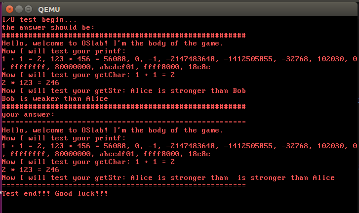

# Lab2实验报告
191300087 左之睿 1710670843@qq.com
## 一、实验进度
&nbsp;&nbsp;&nbsp;&nbsp;&nbsp;&nbsp;&nbsp;&nbsp;除了getstr()函数及其对应的处理例程syscallgetstr()，其余部分均已完成
## 二、实验结果
&nbsp;&nbsp;&nbsp;&nbsp;&nbsp;&nbsp;&nbsp;&nbsp;如下图所示，输入2(其实几都行，但是不能从小键盘输入)之后输出对应的测试结果。

## 三、实验修改的代码位置
&nbsp;&nbsp;&nbsp;&nbsp;&nbsp;&nbsp;&nbsp;&nbsp;首先我下载了todo tree这一插件，这样大致找到了所有需要增添代码的位置。

&nbsp;&nbsp;&nbsp;&nbsp;&nbsp;&nbsp;&nbsp;&nbsp;在实验中，第一步我们要完成内存加载以及进行模式跳转。这要求补全bootMain，loadUMain和设置start.s中的esp，其中loadUMain的填写与bootMain极为相似，对部分值进行修改就可以达成目标。在此仅贴出与bootMain略有不同的几行代码
```
    ~\kvm.c
    ...
	unsigned int elf = 0x200000;//bootMain中为0x100000 
	uint32_t uMainEntry=0x20000;
	for (i = 0; i < 200; i++) {
		readSect((void*)(elf + i*512), 201+i);
	}//bootMain中为1+i
	uMainEntry=((struct ELFHeader *)elf)->entry;
    ...
	enterUserSpace(uMainEntry);
```
&nbsp;&nbsp;&nbsp;&nbsp;&nbsp;&nbsp;&nbsp;&nbsp;第二步需要完善相关中断机制，要求我们：1、键盘中断号压入栈(终断号0x21已于lab2.md中给出)；2、初始化门和idt表，直接依照讲义和相关资料填写即可；3、补全中断处理程序，按照不同中断请求即可完成，贴出部分代码
```
	switch(tf->irq) {
		case -1:
			break;
		case 0xd:
			GProtectFaultHandle(tf);
			break;//一般保护错
		case 0x21:
			KeyboardHandle(tf);
			break;//键盘
		case 0x80:
			syscallHandle(tf);
			break;//系统调用
		default:assert(0);
	}
```

&nbsp;&nbsp;&nbsp;&nbsp;&nbsp;&nbsp;&nbsp;&nbsp;最后，我们开始实现printf和getchar和对应的处理例程。先看printf，在实现时需要注意对格式化输出分情况处理，如下所示
```
switch(format[i]){  //get and turn the variable parameter to string, then put it into buffer
	case 'd':
		decimal = *(int*)(paraList + index);
		count = dec2Str(decimal, buffer,MAX_BUFFER_SIZE, count);
		break;
	case 'x':
		hexadecimal = *(uint32_t*)(paraList +index);
		count = hex2Str(hexadecimal, buffer, MAX_BUFFER_SIZE, count);
		break;
	case 's':
		string = *(char**)(paraList + index);
		count = str2Str(string, buffer, MAX_BUFFER_SIZE, count);
		break;
	case 'c':
		character = *(char*)(paraList + index);
		buffer[count] = character;
		count++;
		break;
	default: //illegal
		state = 2; 
		break;
	}
```
其中dec2Str，hex2Str，str2Str在框架中都有提供。
接下来完成syscallPrint，代码如下
```
void syscallPrint(struct TrapFrame *tf) {
	int sel =  USEL(SEG_UDATA);//TODO: segment selector for user data, need further modification
	char *str = (char*)tf->edx;
	int size = tf->ebx;
	int i = 0;
	int pos = 0;
	char character = 0;
	uint16_t data = 0;
	asm volatile("movw %0, %%es"::"m"(sel));
	for (i = 0; i < size; i++) {
		asm volatile("movb %%es:(%1), %0":"=r"(character):"r"(str+i));		
		// TODO: 完成光标的维护和打印到显存
		if(character == '\n'){
			displayRow++;
			displayCol=0;
			if(displayRow == 25){
				displayRow=24;
				scrollScreen();
			}
		}
		else
		{
			if(displayCol==80){
				displayRow++;
				displayCol=0;
				if(displayRow==25){
					displayRow=24;
					scrollScreen();
				}
			}
			data=character|(0x0c<<8);
			pos=(80*displayRow+displayCol)*2;
			asm volatile("movw %0,(%1)"::"r"(data),"r"(pos+0xb8000));
			displayCol++;			
		}
	}		
	updateCursor(displayRow, displayCol);
}
```
这一部分需要注意到光标到一定位置时需要更新位置。
最后，getchar较为简单，借助系统调用实现即可。
而syscallgetchar则是逻辑较为简单但实现起来稍有困难 
## 四、问题
&nbsp;&nbsp;&nbsp;&nbsp;&nbsp;&nbsp;&nbsp;&nbsp;与很多同学一样，由于ubuntu版本的问题导致了bootload fail，换用16.04后即可

