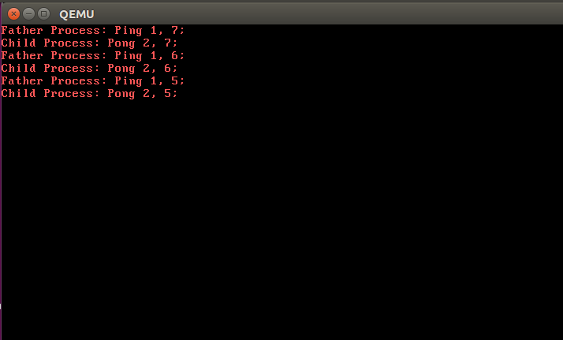
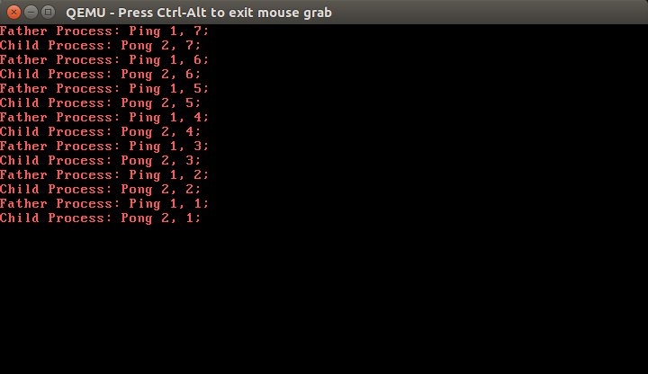

# Lab3实验报告
191300087 左之睿 1710670843@qq.com
## 一、实验进度
&nbsp;&nbsp;&nbsp;&nbsp;&nbsp;&nbsp;&nbsp;&nbsp;完成了所有非选做部分
## 二、实验结果
&nbsp;&nbsp;&nbsp;&nbsp;&nbsp;&nbsp;&nbsp;&nbsp;如下图所示，每隔一段时间会进行打印


## 三、实验修改的代码位置
&nbsp;&nbsp;&nbsp;&nbsp;&nbsp;&nbsp;&nbsp;&nbsp;首先,按照指导pdf的要求，先去完善syscall.c中的库函数，这一部分非常简单，代码如下
```

pid_t fork() {
	return syscall(SYS_FORK, 0, 0, 0, 0, 0);
}


int sleep(uint32_t time) {
	return syscall(SYS_SLEEP,time,0,0,0,0);
}

int exit() {
	return syscall(SYS_EXIT,0,0,0,0,0);
}

```
&nbsp;&nbsp;&nbsp;&nbsp;&nbsp;&nbsp;&nbsp;&nbsp;接下来实现timerhandle函数，这个根据实验指导的描述，实现起来也比较容易
```
void timerHandle(struct StackFrame *sf){
	uint32_t tmpStackTop;
	int i;
	for (i = 0; i < MAX_PCB_NUM; ++i)
		if (pcb[i].state == STATE_BLOCKED){
			if (pcb[i].sleepTime == 1)
				pcb[i].state = STATE_RUNNABLE;		
			else
				pcb[i].sleepTime-=1;	
		}//对应时钟中断功能1
	pcb[current].timeCount++;
	if (pcb[current].timeCount >= MAX_TIME_COUNT) {
		pcb[current].state = STATE_RUNNABLE;
		pcb[current].timeCount = 0;
		for (i = (current + 1) % MAX_PCB_NUM; i != current; i = (i + 1) % MAX_PCB_NUM)
			if (pcb[i].state == STATE_RUNNABLE){
				...切换进程
			}
	}//时钟中断功能2
}

```
&nbsp;&nbsp;&nbsp;&nbsp;&nbsp;&nbsp;&nbsp;&nbsp;最后实现syscallFork,syscallSleep,syscallExit，在此先说较为简单的sleep和rxit，这两个都是先修改当前进程的状态，然后遍历寻找下一个等待中的进程，最后用lab3的pdf中给出的相应代码进行进程切换即可，在此给出syscallSleep的部分代码
```
void syscallSleep(struct StackFrame *sf){
	int i = (current + 1) % MAX_PCB_NUM;
	uint32_t tmpStackTop;
	pcb[current].state = STATE_BLOCKED;
	pcb[current].sleepTime = sf->ecx;
	for (; i != current; i = (i + 1) %MAX_PCB_NUM){
		if (pcb[i].state == STATE_RUNNABLE)
			break;		
	}
	current = i;
	pcb[current].state = STATE_RUNNING;
        ...进程切换
	return;
}
```
&nbsp;&nbsp;&nbsp;&nbsp;&nbsp;&nbsp;&nbsp;&nbsp;较为困难的是syscallFork，首先需要找一个空闲进程被Fork
```
	for (i = 0; i < MAX_PCB_NUM; i++) {
		if (pcb[i].state == STATE_DEAD)
			break;
	}
```
然后将父进程的内容拷贝到子进程，需要注意的是stackTop和prevStackTop以及cs，gs，ds，fs，ss，es并不是通过复制而来，并且cs是USEL(1+2i)，而其他的为USEL（2+2i），最终再设置子进程号即可
```
		for (j = 0; j < 0x100000; j++) {
			*(uint8_t *)(j + (i+1)*0x100000) = *(uint8_t *)(j + (current+1)*0x100000);
		}
		disableInterrupt();
		pcb[i].stackTop = (uint32_t)&(pcb[i].regs);
		pcb[i].prevStackTop = (uint32_t)&(pcb[i].stackTop);
		pcb[i].state = STATE_RUNNABLE;
		pcb[i].timeCount = 0;
		pcb[i].sleepTime = 0;
		pcb[i].pid = i;
		pcb[i].regs.ss = USEL(2+2*i);
		pcb[i].regs.cs = USEL(1+2*i);
		pcb[i].regs.ds = USEL(2+2*i);
		pcb[i].regs.es = USEL(2+2*i);
		pcb[i].regs.fs = USEL(2+2*i);
		pcb[i].regs.gs = USEL(2+2*i);
		pcb[i].regs.eflags = pcb[current].regs.eflags;
		pcb[i].regs.edx = pcb[current].regs.edx;
		pcb[i].regs.ecx = pcb[current].regs.ecx;
		pcb[i].regs.ebx = pcb[current].regs.ebx;
		pcb[i].regs.esp = pcb[current].regs.esp;
		pcb[i].regs.ebp = pcb[current].regs.ebp;
		pcb[i].regs.edi = pcb[current].regs.edi;
		pcb[i].regs.esi = pcb[current].regs.esi;
		pcb[i].regs.eip = pcb[current].regs.eip;
		pcb[i].regs.eax = 0;//子进程号
		pcb[current].regs.eax = i;
 ```
## 四、实验感想
&nbsp;&nbsp;&nbsp;&nbsp;&nbsp;&nbsp;&nbsp;&nbsp;本次实验相对来说较为简单，让我对于系统内部的进程管理加深了理解