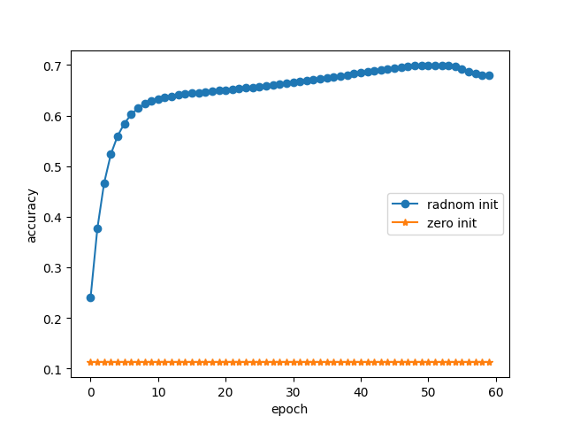
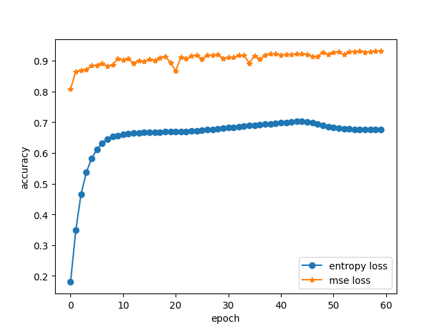
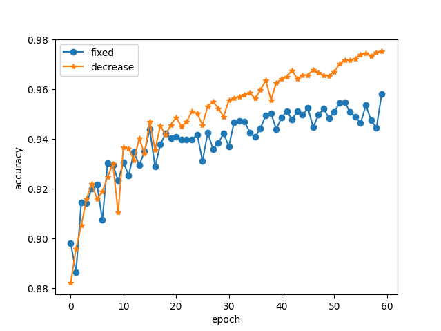
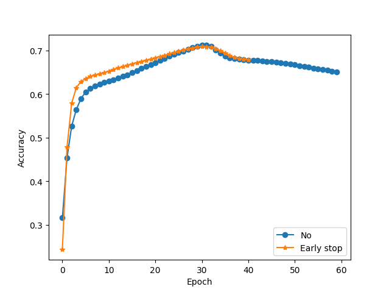
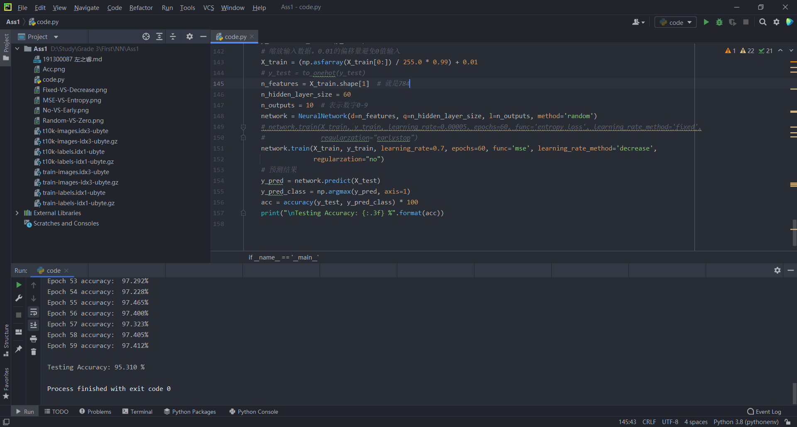

# 神经网络期末作业一实验报告
左之睿 191300087 1710670843@qq.com
### 一、整体工作小结
&nbsp;&nbsp;本次作业中我完成了要求的全部任务，实现了一个单隐层的多层感知机(**作业中没有调用pytorch或者tensorflow，但是导出的依赖包里面有**)，其参数更新采用的方法是标准BP算法，激活函数为sigmoid函数，隐层神经元数目可以自行设置。
&nbsp;&nbsp;<font color=Red>注：代码文件需要和解压后的数据文件放在一个文件夹内才可以运行！！！</font>
&nbsp;&nbsp;并在此基础上进行了作业要求中的几种对比，分别是：
&nbsp;&nbsp;&nbsp;&nbsp;1、参数全零初始化&nbsp;Vs&nbsp;随机初始化(Baseline)
&nbsp;&nbsp;&nbsp;&nbsp;2、均方误差损失函数&nbsp;Vs&nbsp;交叉熵损失函数(Baseline)
&nbsp;&nbsp;&nbsp;&nbsp;3、学习率衰减中的分段常数衰减&nbsp;Vs&nbsp;固定学习率(Baseline)
&nbsp;&nbsp;&nbsp;&nbsp;4、正则化方法中的提前停止&nbsp;Vs&nbsp;不做正则化(Baseline)
&nbsp;&nbsp;对比结果在下一部分详细展示。
### 二、性能对比以及部分原因分析
#### 1、全零初始化&nbsp;Vs&nbsp;随机初始化
两种初始化方法的训练过程对比如图

&nbsp;
最终在测试集上的表现为
| Init     | Accuracy |
| ----------- | ----------- |
| Random      |    72.05%    |
| Zeros   |   20.89%    |
&nbsp;
可以发现，全零初始化的性能完全没有改变，这是因为发生了对称权重现象，导致无法训练。
#### 2、均方误差损失函数&nbsp;Vs&nbsp;交叉熵损失函数
两种方法训练效果对比如图

最终在测试集上的表现为
| Loss function     | Accuracy |
| ----------- | ----------- |
| Entropy loss      |    67.23%    |
| MSE   |    94.27%     |
#### 3、分段常数衰减&nbsp;Vs&nbsp;固定学习率
由于交叉熵函数下的神经网络所需要的学习率实在太小，因此本对比使用基于均方误差损失函数的神经网络进行，训练过程对比如下图。

可见，训练中期后，学习率衰减的表现要明显更优，猜测原因是学习率太大导致无法稳定收敛，而学习率衰减在测试集上的优势并没有训练过程中那么大，猜测原因是过拟合。
&nbsp;
最终在测试集上的表现为
| Learning rate     | Accuracy |
| ----------- | ----------- |
| fixed      |    94.74%    |
| decrease   |    95.79%     |

#### 4、提前停止&nbsp;Vs&nbsp;不做正则化
提前停止这一部分我设定的是在训练中累积有10轮的训练集准确率低于上一轮，就直接停止。
&nbsp;
训练过程对比如图

最终在测试集上的表现为
| Regularzation     | Accuracy |
| ----------- | ----------- |
| No      |    68.81%    |
| Early stop   |   67.81%      |
### 三、关键代码及代码运行过程描述
首先是准备工作，有如下部分
#### 准备工作
**1、读取数据**
```python
def load_mnist_train(path, kind='train'):
    labels_path = os.path.join(path, '%s-labels.idx1-ubyte' % kind)
    images_path = os.path.join(path, '%s-images.idx3-ubyte' % kind)
    with open(labels_path, 'rb') as lbpath:
        magic, n = struct.unpack('>II', lbpath.read(8))
        labels = np.fromfile(lbpath, dtype=np.uint8)
    with open(images_path, 'rb') as imgpath:
        magic, num, rows, cols = struct.unpack('>IIII', imgpath.read(16))
        images = np.fromfile(imgpath, dtype=np.uint8).reshape(len(labels), 784)
    return images, labels

def load_mnist_test(path, kind='t10k'):
    labels_path = os.path.join(path, '%s-labels.idx1-ubyte' % kind)
    images_path = os.path.join(path, '%s-images.idx3-ubyte' % kind)
    with open(labels_path, 'rb') as lbpath:
        magic, n = struct.unpack('>II', lbpath.read(8))
        labels = np.fromfile(lbpath, dtype=np.uint8)
    with open(images_path, 'rb') as imgpath:
        magic, num, rows, cols = struct.unpack('>IIII', imgpath.read(16))
        images = np.fromfile(imgpath, dtype=np.uint8).reshape(len(labels), 784)
    return images, labels


def load_data():
    path = ''
    train_images, train_labels = load_mnist_train(path)  # 60000*784 60000*1
    test_images, test_labels = load_mnist_test(path)  # 10000*784 10000*1
    return train_images, train_labels, test_images, test_labels
```
接下来将输入的y转换成one-hot编码形式，以及将编码转换回标签便于使用
**2、one-hot与lable转换**
```python
def to_onehot(y):
    # 输入为向量，转为onehot编码
    y = y.reshape(-1, 1)  # 即为n*1形式
    enc = OneHotEncoder()
    enc.fit(y)
    y = enc.transform(y).toarray()
    return y
def to_label(y):
    return np.argmax(y, axis=1)
```
除此之外还需要计算预测的准确度，即用转换成label的输出与样本对比
**3、准确率计算**
```python
def accuracy(y_true, y_pred):
    # 输入真实标记和预测值返回Accuracy，其中真实标记和预测值是维度相同的向量
    return np.mean(y_true == y_pred)
```
最后是激活函数sigmoid，便于后续调用
**4、sigmoid函数**
```python
def sigmoid(x):
    return 1.0 / (1 + np.exp(-x))
```

#### 定义类NNet
该类中我们定义初始化参数、训练、预测三个部分。
**1、初始化**
```python
class NeuralNetwork():
    def __init__(self, d, q, l, method):
        # 初始化权重和偏置，输入层d=784个神经元，隐层设q个神经元，输出层l=10个神经元
        # weights
        if method == 'random':
            self.w1 = np.random.rand(d, q) - 0.5  # 输入层到隐层
            self.w2 = np.random.rand(q, l) - 0.5  # 隐层到输出层
        elif method == 'zeros':
            self.w1 = np.zeros((d, q))  # 输入层到隐层
            self.w2 = np.zeros((q, l))  # 隐层到输出层
```
method参数决定神经网络选择何种初始化方法，随机初始化的参数范围是(-0.5,0.5)

**2、预测**
```python
def predict(self, X):
    q_out = sigmoid(np.dot(X, self.w1))
    return sigmoid(np.dot(q_out, self.w2))
```
直接利用训练好的参数即可，$q_{out}$指隐层的输出

**3、训练**
这部分较长，一段一段来看
首先是参数更新，根据损失函数的不同有两种更新方式：
```python
def train(self, X, y, learning_rate, epochs, func, learning_rate_method, regularzation):
    # X:60000*784,y:60000*10,d=784,q=100,l=10,W1:d*q,,W2；q*l
    acc_list = []  # 记录每轮准确度便于画图
    count = 0 # 记录早停
    for epoch in range(epochs):
        for i in range(X.shape[0]):
            q_in = np.dot(X[i], self.w1).reshape(1, -1)  # 1*784 * 784*q
            q_out = sigmoid(q_in).reshape(1, -1)  # 1*q
            y_in = np.dot(q_out, self.w2).reshape(1, -1)  # 1*q * q*10
            y_out = sigmoid(y_in).reshape(1, -1)
            if func == 'mse':
                '''输出层误差'''
                delta2 = (y[i] - y_out).reshape(1, -1)  # 1*l
                '''隐层误差'''
                delta1 = np.dot(self.w2, delta2.T).T  # 1*q
                '''调整输出层权重'''
                self.w2 = self.w2 + learning_rate * np.dot(q_out.T, delta2 * y_out * (1 - y_out))
                '''调整隐层权重'''
                self.w1 = self.w1 + learning_rate * np.dot(X[i].reshape(-1, 1), delta1 * q_out * (1 - q_out))

            elif func == 'entropy loss':
                '''做softmax处理'''
                exp_y_out = np.exp(y_out)
                y_out = exp_y_out / np.sum(exp_y_out)

                w2_loss_func = (y_out - y[i]).reshape(1, -1)  # 1*l
                w2_grad = np.dot(q_out.T, w2_loss_func)  # q*1 * 1*l = q*l
                w1_loss_diff = w2_loss_func  # 1*l
                w1_loss_func = np.multiply(q_out, 1 - q_out) * np.dot(w1_loss_diff, self.w2.T)  # 1*q
                w1_grad = np.dot(X[i].reshape(-1, 1), w1_loss_func)

                self.w1 = self.w1 - learning_rate * w1_grad
                self.w2 = self.w2 - learning_rate * w2_grad
```
train的参数中，func代表选取的损失函数，learning_rate_method代表学习率变化方式，regularzation代表正则化方式。
更新参数这一部分中，i的循环的前四行分别计算了隐层的输入、输出，输出层的输入、输出，后续参数更新便基于这一部分。

接下来这部分分别计算了训练时每轮的准确率，以及根据learning_rate_method和regularzation是否进行相应的调整，并绘制准确率随训练轮数的变化图。
```python
            y_pred = self.predict(X)  # y_pred是概率
            y_pred_class = np.argmax(y_pred, axis=1)
            acc = accuracy(to_label(y), y_pred_class)
            acc_list.append(acc)
            print("Epoch %d accuracy:  %.3f%%" % (epoch, acc * 100))
            if learning_rate_method == 'decrease' and epoch % 10 == 0 and epoch > 0:
                learning_rate = learning_rate - 0.1
            # count=0在前面定义
            if regularzation == "earlystop" and epoch > 0:
                if acc < acc_list[epoch - 1]:
                    count=count+1
                    if count>=10:
                        break
        plt.plot(range(epochs), acc_list)
        plt.show()
```
当选择学习率固定衰减方法时(第二部分中说过基于交叉熵的学习率太小，因此使用基于均方误差的神经网络)，每过10轮训练就将学习率-0.1(使用中将学习率设为0.7，共训练60轮)

当使用“早停”的正则化方法时，当累积出现10次本轮正确率低于上一轮时，就停止训练。

#### 调用并进行训练
首先，获取数据并进行预处理
```python
if __name__ == '__main__':
    X_train, y_train, X_test, y_test = load_data()
    y_train = to_onehot(y_train)  # 60000*10
    # 缩放输入数据。0.01的偏移量避免0值输入
    X_train = (np.asfarray(X_train[0:]) / 255.0 * 0.99) + 0.01
```
由于输入的像素值最大可达255，会导致sigmoid函数值接近1，因此对输入进行缩放处理。

接下来调用NNet进行训练
```python
    n_features = X_train.shape[1]  # 就是784
    n_hidden_layer_size = 60
    n_outputs = 10  # 表示数字0-9
    network = NeuralNetwork(d=n_features, q=n_hidden_layer_size, l=n_outputs, method='random')
    network.train(X_train, y_train, learning_rate=0.00003, epochs=60, func='entropy loss', learning_rate_method='fixed',
                  regularzation="no")
```

最终利用训练好的神经网络对测试集做预测
```python
    y_pred = network.predict(X_test)
    y_pred_class = np.argmax(y_pred, axis=1)
    acc = accuracy(y_test, y_pred_class) * 100
    print("\nTesting Accuracy: {:.3f} %".format(acc))
```
### 四、准确率报告
选取随机初始化+均方误差损失函数+学习率衰减+不做正则化
最终测试集上准确率为95.31%



### 五、全部代码
```python
import numpy as np
import struct
import os
import matplotlib.pyplot as plt
from sklearn.preprocessing import OneHotEncoder


def load_mnist_train(path, kind='train'):
    labels_path = os.path.join(path, '%s-labels.idx1-ubyte' % kind)
    images_path = os.path.join(path, '%s-images.idx3-ubyte' % kind)
    with open(labels_path, 'rb') as lbpath:
        magic, n = struct.unpack('>II', lbpath.read(8))
        labels = np.fromfile(lbpath, dtype=np.uint8)
    with open(images_path, 'rb') as imgpath:
        magic, num, rows, cols = struct.unpack('>IIII', imgpath.read(16))
        images = np.fromfile(imgpath, dtype=np.uint8).reshape(len(labels), 784)
    return images, labels


def load_mnist_test(path, kind='t10k'):
    labels_path = os.path.join(path, '%s-labels.idx1-ubyte' % kind)
    images_path = os.path.join(path, '%s-images.idx3-ubyte' % kind)
    with open(labels_path, 'rb') as lbpath:
        magic, n = struct.unpack('>II', lbpath.read(8))
        labels = np.fromfile(lbpath, dtype=np.uint8)
    with open(images_path, 'rb') as imgpath:
        magic, num, rows, cols = struct.unpack('>IIII', imgpath.read(16))
        images = np.fromfile(imgpath, dtype=np.uint8).reshape(len(labels), 784)
    return images, labels


def load_data():
    path = ''
    train_images, train_labels = load_mnist_train(path)  # 60000*784 60000*1
    test_images, test_labels = load_mnist_test(path)  # 10000*784 10000*1
    return train_images, train_labels, test_images, test_labels


def to_onehot(y):
    # 输入为向量，转为onehot编码
    y = y.reshape(-1, 1)  # 即为n*1形式
    enc = OneHotEncoder()
    enc.fit(y)
    y = enc.transform(y).toarray()
    return y


def to_label(y):
    return np.argmax(y, axis=1)


def accuracy(y_true, y_pred):
    # 输入真实标记和预测值返回Accuracy，其中真实标记和预测值是维度相同的向量
    return np.mean(y_true == y_pred)


'''sigmoid为激活函数'''


def sigmoid(x):
    return 1.0 / (1 + np.exp(-x))


'''定义类NNet，里面包括初始化，训练，预测三部分'''


class NeuralNetwork():
    def __init__(self, d, q, l, method):
        # 初始化权重和偏置，输入层d=784个神经元，隐层设q=100个神经元，输出层l=10个神经元
        # weights
        if method == 'random':
            self.w1 = np.random.rand(d, q) - 0.5  # 输入层到隐层
            self.w2 = np.random.rand(q, l) - 0.5  # 隐层到输出层
        elif method == 'zeros':
            self.w1 = np.zeros((d, q))  # 输入层到隐层
            self.w2 = np.zeros((q, l))  # 隐层到输出层

    def predict(self, X):
        q_out = sigmoid(np.dot(X, self.w1))
        return sigmoid(np.dot(q_out, self.w2))

    def train(self, X, y, learning_rate, epochs, func, learning_rate_method, regularzation):
        # X:60000*784,y:60000*10,d=784,q=100,l=10,W1:d*q,,W2；q*l
        acc_list = []  # 记录每轮准确度便于画图
        acc_list_1 = []  # 与baseline对比的
        count = 0
        for epoch in range(epochs):
            for i in range(X.shape[0]):
                q_in = np.dot(X[i], self.w1).reshape(1, -1)  # 1*784 * 784*q
                q_out = sigmoid(q_in).reshape(1, -1)  # 1*q
                y_in = np.dot(q_out, self.w2).reshape(1, -1)  # 1*q * q*10
                y_out = sigmoid(y_in).reshape(1, -1)
                if func == 'mse':
                    '''输出层误差'''
                    delta2 = (y[i] - y_out).reshape(1, -1)  # 1*l
                    '''隐层误差'''
                    delta1 = np.dot(self.w2, delta2.T).T  # 1*q
                    '''调整输出层权重'''
                    self.w2 = self.w2 + learning_rate * np.dot(q_out.T, delta2 * y_out * (1 - y_out))
                    '''调整隐层权重'''
                    self.w1 = self.w1 + learning_rate * np.dot(X[i].reshape(-1, 1), delta1 * q_out * (1 - q_out))

                elif func == 'entropy loss':
                    '''做softmax处理'''
                    exp_y_out = np.exp(y_out)
                    y_out = exp_y_out / np.sum(exp_y_out)

                    w2_loss_func = (y_out - y[i]).reshape(1, -1)  # 1*l
                    w2_grad = np.dot(q_out.T, w2_loss_func)  # q*1 * 1*l = q*l
                    w1_loss_diff = w2_loss_func  # 1*l
                    w1_loss_func = np.multiply(q_out, 1 - q_out) * np.dot(w1_loss_diff, self.w2.T)  # 1*q
                    w1_grad = np.dot(X[i].reshape(-1, 1), w1_loss_func)

                    self.w1 = self.w1 - learning_rate * w1_grad
                    self.w2 = self.w2 - learning_rate * w2_grad

            y_pred = self.predict(X)  # y_pred是概率
            y_pred_class = np.argmax(y_pred, axis=1)
            acc = accuracy(to_label(y), y_pred_class)
            acc_list.append(acc)
            print("Epoch %d accuracy:  %.3f%%" % (epoch, acc * 100))
            if learning_rate_method == 'decrease' and epoch % 10 == 0 and epoch > 0:
                learning_rate = learning_rate - 0.1
            if regularzation == "earlystop" and epoch > 0:
                if acc < acc_list[epoch - 1]:
                    count = count + 1
                    print(count)
                    if count >= 10:
                        break
        '''绘图代码'''
        # plt.plot(range(len(acc_list)), acc_list, marker='o', label="No")
        # plt.plot(range(len(acc_list_1)), acc_list_1, marker='*', label='Early stop')
        # plt.legend()
        # plt.xlabel('Epoch')
        # plt.ylabel('Accuracy')
        # plt.show()


if __name__ == '__main__':
    X_train, y_train, X_test, y_test = load_data()
    y_train = to_onehot(y_train)  # 60000*10
    # 缩放输入数据。0.01的偏移量避免0值输入
    X_train = (np.asfarray(X_train[0:]) / 255.0 * 0.99) + 0.01
    # y_test = to_onehot(y_test)
    n_features = X_train.shape[1]  # 就是784
    n_hidden_layer_size = 60
    n_outputs = 10  # 表示数字0-9
    network = NeuralNetwork(d=n_features, q=n_hidden_layer_size, l=n_outputs, method='random')
    # network.train(X_train, y_train, learning_rate=0.00005, epochs=60, func='entropy loss', learning_rate_method='fixed',
    #               regularzation="earlystop")
    network.train(X_train, y_train, learning_rate=0.7, epochs=60, func='mse', learning_rate_method='decrease',
                  regularzation="no")
    # 预测结果
    y_pred = network.predict(X_test)
    y_pred_class = np.argmax(y_pred, axis=1)
    acc = accuracy(y_test, y_pred_class) * 100
    print("\nTesting Accuracy: {:.3f} %".format(acc))

```