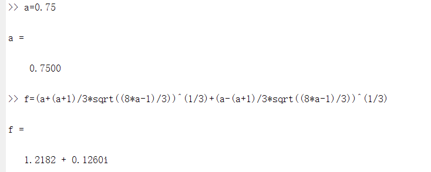
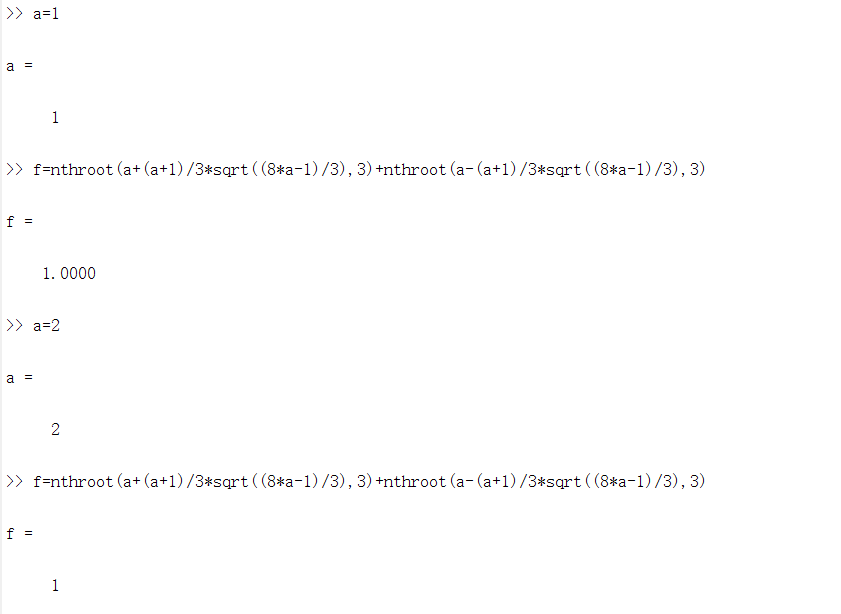
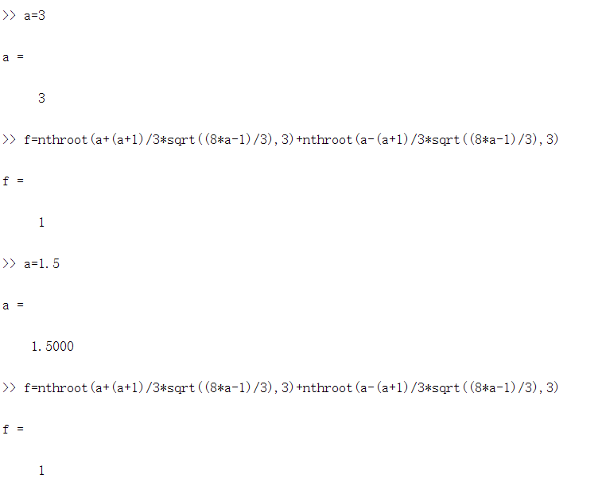

## 作业一
 左之睿 191300087 人工智能学院 人工智能学院选修 本科
### 1、第一章习题
(a)对$a$的要求是根号内为非负数，即$\frac{8a-1}{3}\geq0\Rightarrow a\geq\frac{1}{8}$

(b)$a=\frac{1}{8}$时，原式$=\sqrt[3]{a}+\sqrt[3]{a}=1$

(c)取$a=0.5$，
原式$=\sqrt[3]{0.5+0.5}+\sqrt[3]{0.5-0.5}=1$
我认为该公式的值恒为$1$

(d)结果为$1.2182+0.1260i$，如图所示

(e)原因：使用^$(1/3)$时调用了函数$POW(a,b)$，该函数在$b<1$(此处即为$1/3$)时就会返回复根

修复方法：使用函数$nthroot(a,b)$，正确结果是$1$，用不同的$a$验证结果如下图

(f)
令$t=\sqrt{\frac{8a-1}{3}}$，故$a=\frac{3t^2+1}{8}$，代入原式有：
原式$=\sqrt[3]{\frac{3t^2+1}{8}+\frac{t^2+3}{8}t}+\sqrt[3]{\frac{3t^2+1}{8}-\frac{t^2+3}{8}t}$
$=\sqrt[3]{\frac{t^3+3t^2+3t+1}{8}}+\sqrt[3]{\frac{-t^3+3t^2-3t+1}{8}}$
$=\frac{\sqrt[3]{(t+1)^3}}{2}+\frac{\sqrt[3]{(-t+1)^3}}{2}=1$，证毕

(g)取$a=2$代入题目中给的公式即为本小问中的表达式，故：$$\sqrt[3]{2+\sqrt{5}}+\sqrt[3]{2-\sqrt{5}}=1$$

(h)由卡尔达诺公式，对于一元三次方程$x^3+px+q=0$，令$D=-108(\frac{p^3}{27}+\frac{q^2}{4})$，当$D<0$时，方程有一个实根和两个共轭虚根。
并且，该实根为$\sqrt[3]{-\frac{q}{2}+\sqrt{\frac{q^2}{4}+\frac{p^3}{27}}}+\sqrt[3]{-\frac{q}{2}-\sqrt{\frac{q^2}{4}+\frac{p^3}{27}}}\ \ (*)$
取$p=2a-1,q=-2a$，方程变为$x^3+(2a-1)x-2a=0$，显然有唯一实根$1$
而将$p,q$代入实根表达式$(*)$，得到$\sqrt[3]{a+\frac{a+1}{3}\sqrt{\frac{8a-1}{3}}}+\sqrt[3]{a-\frac{a+1}{3}\sqrt{\frac{8a-1}{3}}}=1$，等式左边就是本题中给出的表达式

### 2、第二章习题6
(a)
期望$E(X)=\int_xxp(x)dx=\int_0^\infty \beta xe^{-\beta x}dx=\frac{1}{\beta}$
方差$Var(X)=E[(X-E(X))^2]=E(X^2)-(E(X))^2=\int_xx^2p(x)dx-\frac{1}{\beta^2}$
$=\int_x\beta x^2e^{-\beta x}dx-\frac{1}{\beta^2}=-\int_xx^2de^{-\beta x}-\frac{1}{\beta^2}=\frac{1}{\beta^2}$

(b)$x\geq0$时，$F(x)=\int_{-\infty}^xp(t)dt=\int_0^x\beta e^{-\beta t}dt=1-e^{-\beta x}$
$x<0$时，$F(x)=0$
故$$F(X)=\begin{cases} 0\ \ \ \ \ \ \qquad \ x<0\\  1-e^{-\beta x}\ \ x\geq0\\ \end{cases} $$

(c)证明如下：
等式左边由贝叶斯公式
$Pr(x\geq a+b|x\geq a)=\frac{Pr(x\geq a+b,x\geq a)}{Pr(x\geq a)}=\frac{Pr(x\geq a+b)}{Pr(x\geq a)}=\frac{1-F(a+b)}{1-F(a)}$
$=\frac{e^{-\beta(a+b)}}{e^{-\beta a}}=e^{-\beta b}$
而等式右边$Pr(x\geq b)=1-F(b)=e^{-\beta b}$
左边=右边，得证

(d)设其寿命为$X$
其期望寿命$E(X)=\frac{1}{\beta}=1000$小时

设已经工作2000h小时后剩余寿命为y，由无记忆性$$Pr(X\geq2000+y|X\geq2000)=Pr(X\geq y)$$
故剩余寿命期望仍为1000小时
### 3、第二章习题7
(a)由题意，$\beta=3$，故$E[X]=\frac{1}{3},Var(X)=\frac{1}{9}$

(b)可以使用马尔可夫不等式
$Pr(X\geq1)\leq\frac{E[X]}{1}\rightarrow Pr(X\geq1)\leq\frac{1}{3}$

(c)可以使用切比雪夫不等式
$Pr(|X-E[X]|\geq k\sigma)\leq\frac{1}{k^2}$，代入$E[X],\sigma=\sqrt{Var(X)}$，有：
$$Pr(|X-\frac{1}{3}|\geq\frac{k}{3})\leq\frac{1}{k^2}$$
取$k=2$，有：
$$Pr(|X-\frac{1}{3}|\geq\frac{2}{3})=Pr(X\geq1\ or\ X\leq-\frac{1}{3})\leq\frac{1}{4}$$
其中，$Pr(X\geq1\ or\ X\leq-\frac{1}{3})=Pr(X\geq1)+Pr(X\leq-\frac{1}{3})$
由于是指数分布，$Pr(X\leq-\frac{1}{3})=0$
故$$Pr(X\geq1)\leq\frac{1}{4}$$

(d)取$a=\frac{2}{3}$，由单边切比雪夫不等式：
$$Pr(X\geq1)\leq\frac{Var(X)}{Var(X)+a^2}=\frac{1}{5}$$

(e)$Pr(X\geq1)=1-F(1)=e^{-3}$

(f)马尔可夫不等式，切比雪夫不等式，单边切比雪夫不等式估计的准确度依次增加

### 4、第二章习题10
(a)$f(x)=e^{ax}\Rightarrow f''(x)=a^2e^{ax}\geq0$，故$f(x)$是凸函数

(b)$g(x)=lnx\Rightarrow g''(x)=-\frac{1}{x^2}<0$，故$g(x)$是凹函数

(c)$x>0$时，$h''(x)=\frac{1}{x}>0$，为凸函数，将定义域变为$[0,+\infty)$后，

对任意$x,y>0$，由于$x>0$时是凸函数，故必然有
$h(\lambda x+(1-\lambda)y)\leq\lambda h(x)+(1-\lambda)h(y)$

对$x=0,y>0$的情况，设$\lambda\in[0,1]$
$h(\lambda x+(1-\lambda)y)=h((1-\lambda)y)=(1-\lambda)yln((1-\lambda)y)$
而$\lambda h(x)+(1-\lambda)h(y)=(1-\lambda)h(y)=(1-\lambda)ylny$
由于$\lambda\in[0,1]$，故$(1-\lambda)y\leq y$，又因为$lnx$在定义域上单调增，故$ln(1-\lambda)y\leq lny$，所以：
$$\forall x\not=y,x,y\in[0,+\infty),\\
h(\lambda x+(1-\lambda y))\leq\lambda h(x)+(1-\lambda)h(y)$$
故$h(x)=xlnx$在$[0,+\infty)$上是凸函数

(d)该问题形式化为：
$$\begin{aligned}
&minimize\ -H=\sum\limits_{i=1}^np_ilog_2p_i\\
&s.t.\ \ \sum\limits_{i=1}^np_i=1
\end{aligned}$$
令$L(p_1,..,p_n,\lambda)=\sum\limits_{i=1}^np_ilog_2p_i+\lambda(\sum\limits_{i=1}^np_i-1)$
求偏导，有$$\begin{aligned}
&\frac{\partial L}{\partial p_i}=log_2p_i+\frac{1}{ln2}+\lambda=0,i=1,...,n\\
&\frac{\partial L}{\partial \lambda}=\sum\limits_{i=1}^np_i-1=0
\end{aligned}$$
解得$\lambda=log_2n-ln2,p_i=\frac{1}{n},i=1,...,n$