## 作业二
左之睿 191300087 人工智能学院 人工智能学院选修 本科
### 1、第三章习题1
(a)编译成功截图如下：
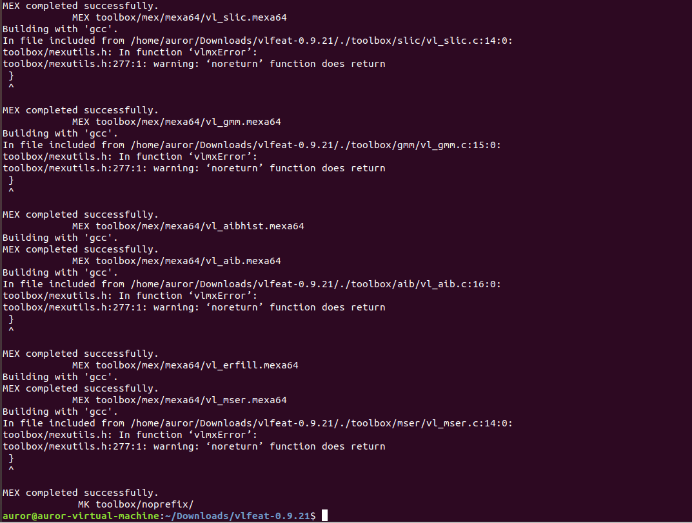
Matlab中成功输出版本如下：
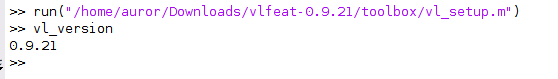

(b)matlab代码如下图：
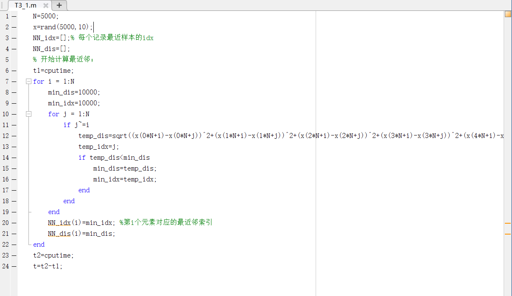
运行结果如下
首先是最近邻的距离和索引：
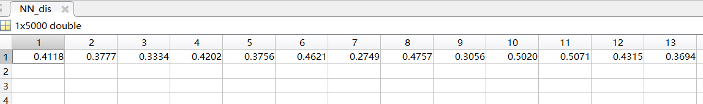
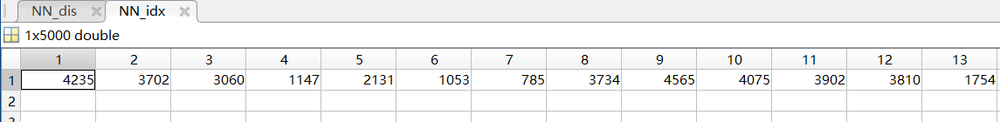
接下来是运行时间：
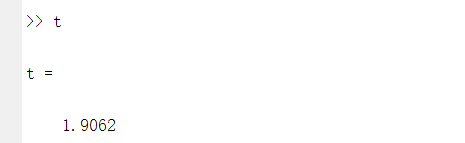

(c)代码如下：
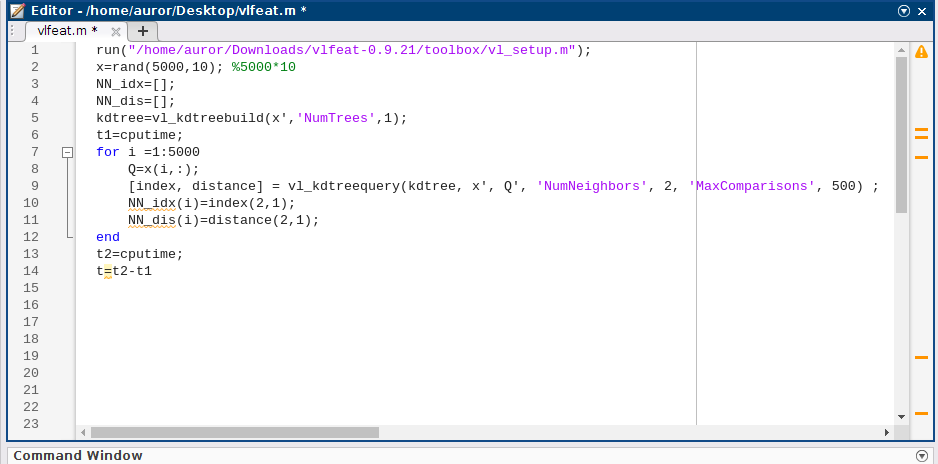
**由于vl\_kdtreequery找的是最近邻，因此需要将NumNeighbors设置为2，并且取第二个值作为索引和距离，否则找到的最近邻就是这个点本身**

找到的索引和距离如下：
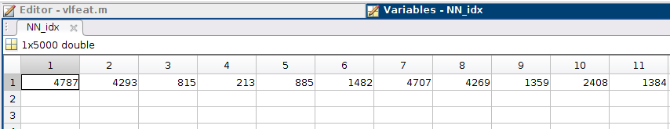
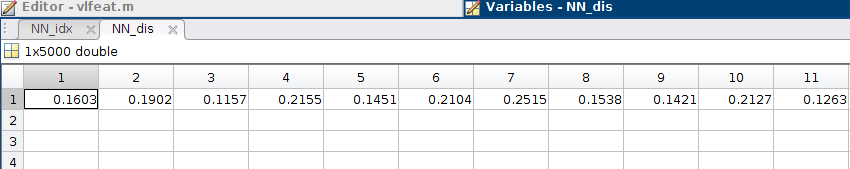
耗时如图
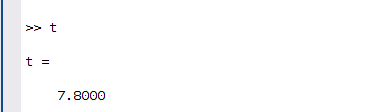

(d)用vlfeat找到的最近邻和按照准确计算距离找的最近邻作比较从而计算错误率。
实验中错误率很低，接近于0，下图是一次实验中的错误率：
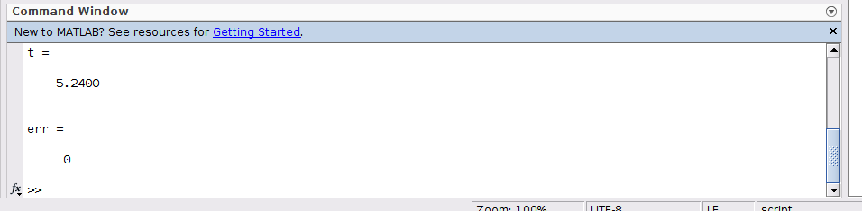

(e)Numtrees增大时，运行时间变长，错误率没有明显变化；
MaxNumComparisons增大或减小对运行时间没有明显影响，其值越大错误率越低，且大到一定程度后错误率为0

(f)数据集变小时，运行时间减小，但只要MaxNumComparisons足够大，错误率就为0，若MaxNumComparisons较小(远小于数据集的规模时)，则数据集越小错误率越低；
数据集变大时，运行时间增大，错误率同样与MaxNumComparisons挂钩，当MaxNumComparisons小于数据集规模时，数据集越大，错误率越高。

### 2、第四章习题5
(a)表格补全如下：
| 下标  |  类别标记 | 得分  |  查准率 | 查全率  | AUC-PR  | AP  |
|---|---|---|---|---|---|---|
| 0  |    |      | 1.0000     | 0.0000     | -  | - |
|  1 |  1 | 1.0  |   1        |    0.2     |  0.2*1  |  0.2*1 |
| 2  |  2 | 0.9  |   1/2      |    0.2     |   0 |  0 |
|  3 |   1| 0.8  |   2/3      |    0.4     |  0.2*7/12  | 0.2*2/3  |
| 4  |  1 | 0.7  |   3/4      |    0.6     |  0.2*17/24  |  0.2*3/4 |
| 5  |   2| 0.6  |   3/5      |    0.6     | 0   |  0 |
| 6  |   1| 0.5  |   4/6      |    0.8     | 0.2*19/30   | 0.2*4/6  |
| 7  |   2| 0.4  |   4/7      |    0.8     |  0  |  0 |
| 8  |   2| 0.3  |   4/8      |    0.8     |  0  |  0 |
| 9  |   1| 0.2  |   5/9      |    1       |  0.2*19/36  | 0.2*5/9  |
| 10 |   2| 0.1  |   5/10     |    1       | 0   | 0  |
|    |    |      |         |         |  1243/1800$\approx$0.691  |  131/180$\approx$0.728 |

(b)填表见(a)中表格

AUC-PR和AP都是对PR曲线下方面积的估计，因此二者的值应该相似

(c)交换后，仅最后三行发生改变，列表如下：
| 下标  |  类别标记 | 得分  |  查准率 | 查全率  | AUC-PR  | AP  |
|---|---|---|---|---|---|---|
| 9  |   2| 0.2  |   4/9      |    0.8       |  0  | 0  |
| 10 |   1| 0.1  |   5/10     |    1       | 0.2*17/36   | 0.2*5/10  |
|    |    |      |         |         |  1223/1800$\approx$0.679 | 43/60$\approx$0.717 |

(d)编程结果如下图
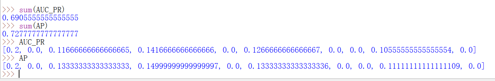
确实与(a)中表格结果相吻合

### 3、第四章习题8
(a)出现了4次，运行截图如下：
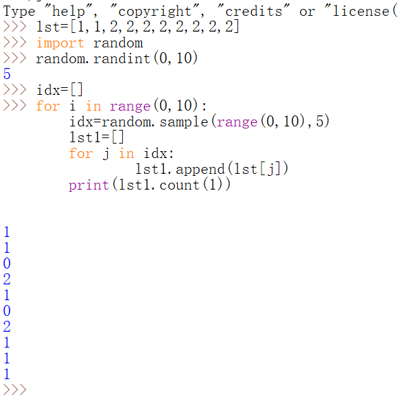

(b)若认为划分后两个子集没有区别，则$(0,2)$出现的概率是$\frac{C_2^2*C_8^3}{C_{10}^5}=2/9$

若认为划分后子集有区别(如测试集和训练集)，则出现概率是$\frac{C_2^2C_8^3+C_8^5}{C_{10}^5}=4/9$

(c)
第一轮中训练集包含2个第1类样本，测试集中全是第2类样本。这种情况对验证没有影响。

第二轮中训练集包含全是第2类样本，测试集中包含2个第1类样本。这种情况下验证集所有样本都会被预测为第2类。

(d)采样的大小为$5$，总样本数为$10$，故样本比例为$5/10=0.5$，即每类采样时均按照这个比例确定该类的样本数，对于第1类，其采样时的样本数即为$0.5*2=1$，故采用分层采样时第一类样本的分布始终为$(1,1)$
### 4、第五章习题1
(a)$XX^T=(U\Sigma V^T)(U\Sigma V^T)^T=U\Sigma V^TV\Sigma^TU^T=U\Sigma\Sigma^T U^T=U\Sigma\Sigma^TU^{-1}$
故$XX^T$的特征值即为$\Sigma\Sigma^T$的对角线元素，令$k=\min\{m,n\}$，则特征值为$\sigma_1^2,...\sigma_k^2$和$m-k$个$0$。
特征向量为$U$的对应列向量

(b)与(a)类似，$X^TX=V\Sigma^T\Sigma V^{-1}$
其特征值为$\sigma_1^2,...\sigma_k^2$和$n-k$个$0$。
特征向量为$V$的对应列向量

(c)他们有$k$个特征值相同，均为$\sigma_1^2,...,\sigma_k^2$

(d)$X$的$k$个奇异值的平方就是$XX^T(X^TX)$的特征值中的$k$个

(e)$XX^T$仅为$2*2$的矩阵，故先计算其特征值，$X^TX$的特征值即为这两个特征值和$99998$个$0$

### 5、第五章习题2
(a)忘记减去平均向量时，第一个特征向量和平均向量之间的corr小于1，且绝对值也较小。
(b)scale变化时，$e1$发生变化，$new\_e1$不变。
正确的特征向量是
$$( 0.1799,
    0.1593,
    0.6602,
   -0.5220,
    0.0266,
   -0.1005,
   -0.4354,
    0.1580,
   -0.0459,
   -0.0803)$$