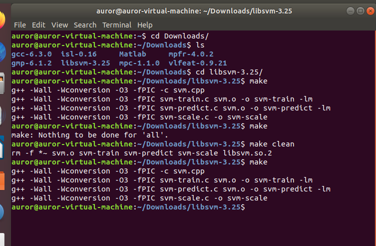
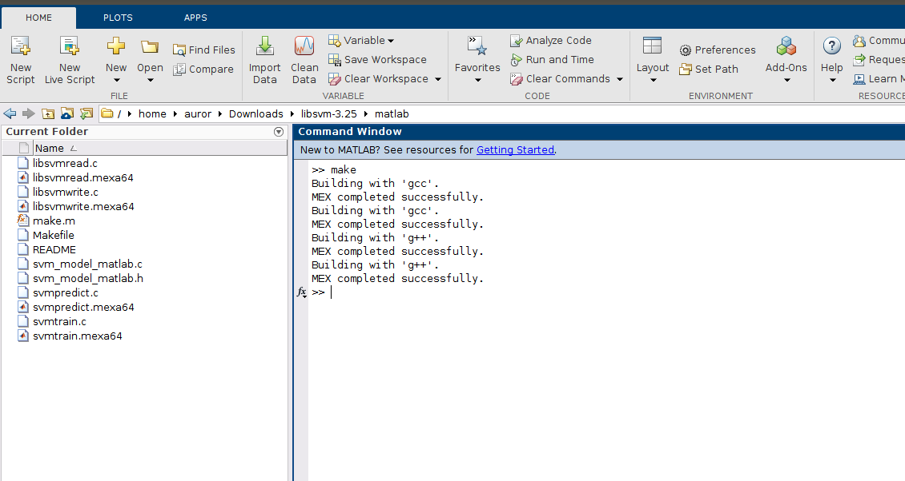
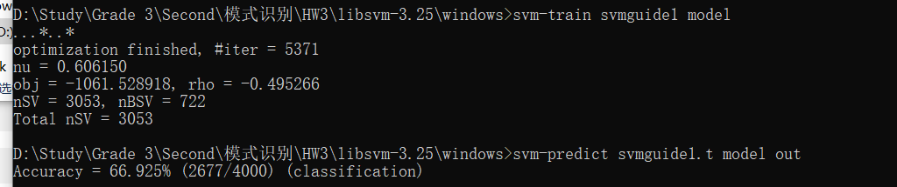
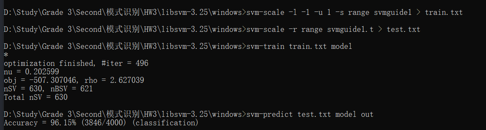
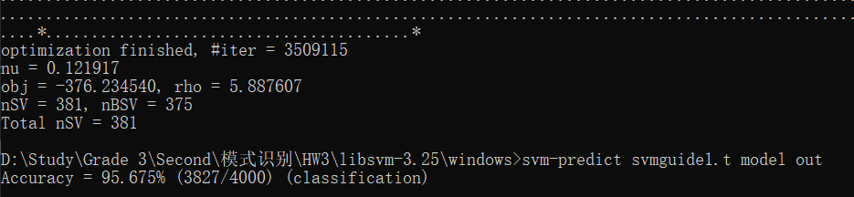
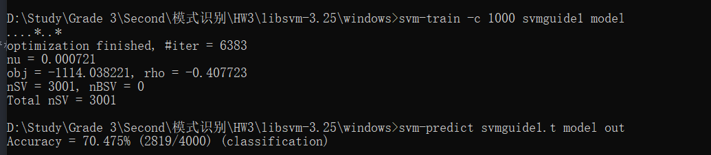
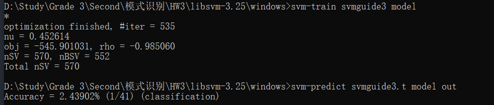
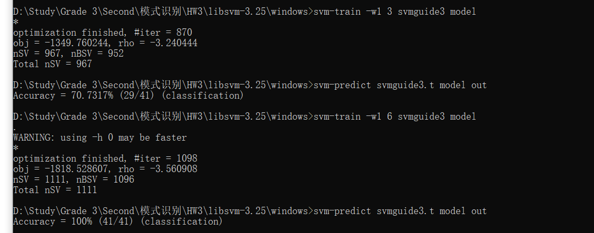

## 作业三
左之睿 191300087 人工智能学院 人工智能学院选修 本科
### 1、第六章习题1
(a)设X的列秩为r，故X的列向量可以由一组基$\{c_1,...,c_r\}$表示，故$m*r$矩阵$C=[c_1,...,c_r]$可以使得X的每一个列向量都是C的所有列向量构成的一个线性组合，即存在$r*n$矩阵$R$使得$X=CR$，这也意味着X的每个行向量都是R的行向量的线性组合，即**X的行秩$\leq$R的行秩**，但是R一共只有r行，所以R的行秩$\leq r$，即**X的行秩$\leq$其列秩r**

类似的方法可以证明X的列秩$\leq$其行秩。

综上，行秩=列秩，因此$rank(X)=rank(X^T)$

(b)行秩必然$\leq$行数m
列秩必然$\leq$列数n
由(a)知，行秩=列秩，故$$rank(A)\leq\min\{m,n\}$$

(c)设$rank(X)=a,rank(Y)=b$，由于行秩=列秩，故考察行向量。
设X行向量的极大线性无关向量组为$\{x_1,...,x_a\}$
Y行向量的极大线性无关向量组为$\{y_1,...,y_b\}$
对于$X+Y$而言，其行向量一定属于$span\{x_1,...,x_a,y_1,...,y_b\}$，即$$rank(X+Y)\leq rank(X)+rank(Y)$$

(d)记$A=XY$，则$A$的每个行向量都是$Y$的行向量的线性组合，故A的行秩$\leq$Y的行秩(即Y的秩)
类似的，A的每个列向量都是X的列向量的线性组合，故A的列秩$\leq$X的列秩(即X的秩)

综上，$rank(A)\leq rank(X)\ and\ rank(A)\leq rank(Y)$
$\Rightarrow rank(A)\leq\min\{rank(X),rank(Y)\}$

(e)证明两个性质：
1、A列满秩时，则$rank(AB)=rank(B)$
2、A行满秩时，则$rank(BA)=rank(B)$

证明性质1如下：
当A列满秩时，将其行最简形矩阵写成分块矩阵形式$$A_0=\begin{pmatrix}
E_n\\
0\\
\end{pmatrix}_{m*n}$$
$0$代表零矩阵，此外还存在可逆方阵$P$(可逆所以满秩)使$PA=PA_0$
故$PAB=\begin{pmatrix}
E_n\\
0\\
\end{pmatrix}B=\begin{pmatrix}
B\\
0\\
\end{pmatrix}$
由于满秩方阵P可看成有限个初等方阵之之积，故与P相乘实际上相当于做初等变换
故$rank(AB)=rank(PAB)=rank(B)$
性质2证明同理，不再赘述

当$m\geq n$时，$X$列满秩，$X^T$行满秩
由性质1，$rank(XX^T)=rank(X^T)=rank(X)$
由性质2，$rank(X^TX)=rank(X)$
故$rank(X)=rank(XX^T)=rank(X^TX)$
$m<n$时同理，不再赘述

(f)当$x$是零向量时，$xx^T$的秩=0；$x$非零向量时，$xx^T$的秩为1

证明题解答如下：对于实对称矩阵$X$，存在正交矩阵$Q$满足$X=Q^{-1}\Lambda Q$，其中$\Lambda=diag(\lambda_1,...,\lambda_r)$，$\lambda_i$是X的特征值

由于正交矩阵满秩，故X的秩=$\Lambda$的秩=X的非零特征值的个数
### 2、第六章习题4
(a)直接对等式右边做矩阵乘法即可证明两边相等。

(b)结果为$(v_1,...,v_k,0,...,0)^T$(从第k个元素之后全是0)

(c)第k轮循环会将A的第k列中第k+1个及之后的元素全部变为0(如k=1时，$A^{(2)}$的第一列中第2到n个元素全为0)，运行完该算法后最终A会变成一个上三角矩阵

(d)
行列式=1证明：
$M_k$是下三角矩阵，故其行列式=其对角线元素乘积$\Rightarrow det(M_k)=1$

下三角矩阵证明：
对于两个下三角矩阵，其乘积仍然为下三角矩阵，故$L=M_{n-1}...M_1$也是下三角矩阵
由矩阵乘积的性质，$det(L)=det(M_{k-1})...det(M_1)=1$，证毕

(e)
存在性证明：
由算法流程，$A^{(n)}=LA$，而其中的$L=M_{n-1}...M_1$，在(d)中已经证得L是一个对角线元素为1的下三角矩阵，故存在性得证。

唯一性证明：
不妨假设分解结果不唯一，即$A=L_1U_1=L_2U_2$，其中$L_1,U_1,L_2,U_2$均可逆(A奇异)，故$U_1U_2^{-1}=L_1^{-1}L_2$，U都是上三角矩阵，L都是下三角矩阵且对角线元素为1，这意味着若要满足等式，则$U_1U_2^{-1}=L_1^{-1}L_2=I\Rightarrow L_1=L_2,U_1=U_2$，唯一性得证

(f)首先，A有唯一的LU分解$A=LU$，又因为A的实对称正定矩阵，故U的对角线元素非0，即U也可以分解成$U=DP$，$D=diag(u_{11},...,u_{nn})$，P是一个对角线元素为1的上三角矩阵，且在上三角中，第i行的1之后的元素为$(\frac{u_{i,i+1}}{u_{ii}},...,\frac{u_{in}}{u_{ii}})$，此时$A=LDP$

$A^T=A\Rightarrow (LDP)^T=P^TDL^T(D是对角阵)=LDP\Rightarrow P=L^T$，即$A=LDL^T$
因为LU分解是唯一的，相应的LDL分解同样具有唯一性。

(g)对于LDL分解$A=LDL^T$，若D对角线元素为正，则可令$G=LD^{\frac{1}{2}}$，此时得到$A=GG^T$

先说明D对角线元素为正：A正定$\rightarrow$A的各阶顺序主子式$>0\rightarrow$D的对角线元素为正，即可以令$D=D^{\frac{1}{2}}D^{\frac{1}{2}}$

再说明$G=LD^{\frac{1}{2}}$是对角线元素为正的下三角矩阵：由于L是对角线元素为1的下三角矩阵，D是对角线元素为正的对角阵，显然$G=LD^{\frac{1}{2}}$是对角线元素为正的下三角矩阵

最后是唯一性，由于LDL分解唯一，故$G=LD^{\frac{1}{2}}$唯一

综上，存在唯一的Cholesky分解

### 3、第七章习题1
(a)编译成功截图如下：

(b)
i. 结果如下，准确率为66.925%

ii. 结果如下，规范化之后准确率提升到96.15%

iii. 结果如下，准确率为95.675%

iv. 结果如下，准确率为70.475%

v. 使用easy.py最终得到$C = 2, \gamma = 2$，使用此参数训练得到准确率是96.875%

从实验中不难发现，合适的超参数对模型性能的影响很大，除此之外，数据是否规范化也是提高模型性能的重要因素

(c)svmguide3就是一个不平衡数据集。
在默认参数下准确率很低，仅有2.43902%，如下图所示

通过-wi参数给第1类赋予权重后，随着权重不断增大模型准确率也不断提升，当设置到6时测试集准确率甚至达到了100%

### 4、第七章习题2
(a)欲证$\kappa_{HI}$是合法的核函数，即为证对非负向量样本集$\{\mathbf{x}_1,...,\mathbf{x}_n\}$，核矩阵$K=(\kappa_{HI}(\mathbf{x}_i,\mathbf{x}_j))_{n*n}$是半正定的。

任取向量$\mathbf{a}\in R^n$，有
$$
\begin{aligned}
\mathbf{a}^TK\mathbf{a}&=\sum\limits_{p=1}^n\sum\limits_{q=1}^na_pK_{ij}a_q\\
&=\sum\limits_{p=1}^n\sum\limits_{q=1}^na_pa_q\sum\limits_{i=1}^d\kappa_{HI}(x_{pi},x_{qi})\\
&=\sum\limits_{p=1}^n\sum\limits_{q=1}^n\sum\limits_{i=1}^da_pa_q\kappa_{HI}(x_{pi},x_{qi})\\
&=\sum\limits_{i=1}^d\mathbf{a}^TK'_i\mathbf{a}
\end{aligned}$$
其中，$K_i'$是将样本$x_i$中各维度元素拿出来用$\kappa_{HI}$生成的核矩阵，$\mathbf{x_i}$是非负向量，故其个元素也是非负标量，又因为$\kappa_{HI}$对非负标量是合法的核函数，故$K'_i$半正定，$\mathbf{a}^TK_i'\mathbf{a}\geq0$，因此，$K$也半正定，因此$\kappa_{HI}$对非负向量也是合法的核函数

(b)由于Y只是由于将$x_1,...,x_n$重新排序获得，故X经过一系列初等变换可以变成Y，即$Y=P^TXP$，P是若干个初等矩阵之积，其可逆。

当X正定时，对任意$a\in R^n$，$a^TYa=a^TP^TXPa=(Pa)^TX(Pa)>0$(半正定加等号即可)

当Y正定时，对任意$a\in R^n$，$a^TXa=a^T(P^{-1})^TYP^{-1}a=(P^{-1}a)^TY(P^{-1}a)>0$(半正定加等号即可)
综上，当且仅当Y(半)正定时，X是(半)正定的

(c)由于$x_1,...,x_n$已经按大小顺序排好，故核矩阵第i行的元素为$x_1,...,x_i,x_i,...,x_i$

对该矩阵做如下初等变换P：每一行减上一行，每一列减左一列
之后得到矩阵$A=diag(x_1,x_2-x_1,...,x_n-x_{n-1})$，注意其对角线个元素均非负，且$A=P^TXP$，$P^T$就相当于LDL分解中的L。

因为A对角元素非负，故A是半正定的，在(b)中，$Y=P^TXT$半正定当且仅当X半正定，本小问中，$A=P^TXP$，故A半正定当且仅当X半正定。

**由于A是半正定的，故X也是半正定的，证毕**

(d)欲证$\sum\limits_{i=1}^d\min(x_i,y_i)\leq\sum\limits_{i=1}^d\frac{2x_iy_i}{x_i+y_i}$，只需证对任意两正标量$x,y$，有$\min(x,y)\leq\frac{2xy}{x+y}$即可。

当$\min(x,y)=x$时，$\frac{2xy}{x+y}-x=\frac{xy-x^2}{x+y}\geq0\Rightarrow\frac{2xy}{x+y}\geq\min(x,y)$
$\min(x,y)=y$同理

综上，对任意两正标量$x,y$，有$\min(x,y)\leq\frac{2xy}{x+y}$，故$\sum\limits_{i=1}^d\min(x_i,y_i)\leq\sum\limits_{i=1}^d\frac{2x_iy_i}{x_i+y_i}$，即$\kappa_{HI}(\mathbf{x},\mathbf{y})\leq\kappa_{\chi^2}(\mathbf{x},\mathbf{y})$

(e)
先证明是合法的核函数：取$\phi(x)=(\sqrt{x_1},...,\sqrt{x_n})$，即有$\kappa_{HE}(x,y)=\phi^T(x)\phi(y)$，因此是合法的核函数

再证$\kappa_{HE}(x,y)\geq\kappa_{\chi^2}(x,y)$，同样只需要证明对任意两正标量$x,y$，有$\sqrt{xy}\geq\frac{2xy}{x+y}$即可。
基础不等式有$\frac{1}{x}+\frac{1}{y}\geq2\sqrt{\frac{1}{xy}}\Rightarrow\sqrt{xy}\geq\frac{2}{1/x+1/y}=\frac{2xy}{x+y}$

故有$\kappa_{HE}(x,y)\geq\kappa_{\chi^2}(x,y)$

(f)设$x$的特征中，最大值为$a$，令$\phi:N^d\rightarrow \{0,1\}^{ad},\ \phi(x)=(\phi_1(x_1),...,\phi_d(x_d))$，其中$\phi_i(x_i)=(1,1...,1,0,...,0)$，即用长度为a的01向量来表示x的每个特征，其中1的个数即为$x_i$对应的数值。

对于标量x,y，$\phi^T(x)\phi(y)=\min(x,y)$
对向量x,y，$\phi^T(x)\phi(y)=\sum\limits_{i=1}^d\min(x_i,y_i)=\kappa_{HI}(x,y)$

### 5、第九章习题2
(a) LLE的优化问题是：$\min E=\sum\limits_{i=1}^ne_i=\sum\limits_{i=1}^nW^T_i(\mathbf{x}_i-\mathbf{x}_j)(\mathbf{x}_i-\mathbf{x}_j)^TW_i$
其中，$W_i=(w_{i1},...,w_{ik})^T$是k个近邻样本权重
令$Z_j=(\mathbf{x}_i-\mathbf{x}_j)(\mathbf{x}_i-\mathbf{x}_j)^T$，$\mathbf{x}_j$是$\mathbf{x}_i$的k个近邻，故约束条件可以写成$W_i^Te=1$，e是长度为k的全1向量

故Lagrange函数$L(W,\lambda)=\sum\limits_{i=1}^nW_i^TZ_iW_i+\lambda(W^T_ie-1)$

对其求偏导等于0可以解得$W_i=\frac{Z_i^{-1}e}{e^TZ_i^{-1}e}$

(b)
i.将$\mathbf{x}_i=Q\mathbf{x}_i$代入$e_i$
$$\begin{aligned}
e_i&=||Q(\mathbf{x}_i-\sum\limits_{j=1}^nw_{ij}\mathbf{x}_j)||^2\\
&=[Q(\mathbf{x}_i-\sum\limits_{j=1}^nw_{ij}\mathbf{x}_j)]^T[Q(\mathbf{x}_i-\sum\limits_{j=1}^nw_{ij}\mathbf{x}_j)]\\
&=(\mathbf{x}_i-\sum\limits_{j=1}^nw_{ij}\mathbf{x}_j)^TQ^TQ(\mathbf{x}_i-\sum\limits_{j=1}^nw_{ij}\mathbf{x}_j)\\
&由于QQ^T=Q^TQ=I\\
&=(\mathbf{x}_i-\sum\limits_{j=1}^nw_{ij}\mathbf{x}_j)^T(\mathbf{x}_i-\sum\limits_{j=1}^nw_{ij}\mathbf{x}_j)\\
&=e_i
\end{aligned}$$
即旋转时保持不变性

ii.将$\mathbf{x}_i=\mathbf{x}_i+t$代入$e_i$
$$\begin{aligned}
e_i&=||\mathbf{x}_i+t-\sum\limits_{j=1}^nw_{ij}(\mathbf{x}_j+t)||^2\\
&=||\mathbf{x}_i+t-\sum\limits_{j=1}^nw_{ij}\mathbf{x}_j-t\sum\limits_{j=1}^nw_{ij}||^2\\
&=||\mathbf{x}_i-\sum\limits_{j=1}^nw_{ij}\mathbf{x}_j||^2\\
&=e_i
\end{aligned}$$
即平移时保持不变性

iii.将$\mathbf{x}_i=s\mathbf{x}_i$代入$e_i$
$$\begin{aligned}
e_i&=||s\mathbf{x}_i-\sum\limits_{j=1}^nw_{ij}s\mathbf{x}_j||^2\\
&=s^2||\mathbf{x}_i-\sum\limits_{j=1}^nw_{ij}\mathbf{x}_j||^2\\
&=s^2e_i
\end{aligned}$$
本质上就是给目标函数乘了一个常数的系数，不影响后续求解，故缩放时保持不变性

(c)
原因：重构向量的权重$w_{ij}$是乘在了$\mathbf{x}_i$的近邻样本上，这反映了$\mathbf{x}_i$与其近邻样本$\mathbf{x}_j$之间的关系，因此通过这种方式求解$\mathbf{x}_i$的重构表示可以保留局部上的样本之间的关系，从而能够保持局部几何性质。

消去了哪些自由度：$\sum\limits_{i=1}^ny_i=0$消去了平移自由度
$\sum\limits_{i=1}^ny_iy_i^T=I$消去了缩放自由度

仍存在的自由度是否有负面影响：仍存在旋转自由度，但从(b)的i可知不会产生负面影响

(d)$\sum\limits_{i=1}^n||\mathbf{y}_i-\sum\limits_{j=1}^nw_{ij}\mathbf{y}_j||^2=\sum\limits_{i=1}^n||(1-w_{ii})\mathbf{y}_i+\sum\limits_{j=1,j\not=i}^n(-w_{ij})\mathbf{y}_j||^2$

其中，$(1-w_{ii})\mathbf{y}_i+\sum\limits_{j=1,j\not=i}^n(-w_{ij})\mathbf{y}_j=\sum\limits_{j=1}^n(I-W)\mathbf{y}_j$

故优化目标函数$$
\begin{aligned}
    &=\sum\limits_{i=1}^n||\sum\limits_{j=1}^n(I-W)_{ij}\mathbf{y}_j||^2\\
    &=\sum\limits_{i=1}^n[(\sum\limits_{t=1}^n(I-W)_{it}\mathbf{y}_t)^T(\sum\limits_{j=1}^n(I-W)_{ij}\mathbf{y}_j)]\\
    &=\sum\limits_{t=1}^n\sum\limits_{j=1}^n\sum\limits_{i=1}^n[(I-W)^T_{it}(I-W)_{ij}\mathbf{y}_t^T\mathbf{y}_j]\\
    &=\sum\limits_{t=1}^n\sum\limits_{j=1}^nM_{tj}\mathbf{y_t}^T\mathbf{y}_j\\
    &=\sum\limits_{i=1}^n\sum\limits_{j=1}^nM_{ij}\mathbf{y}_i^T\mathbf{y}_j
\end{aligned}$$

(e)
1)证明M半正定
$\forall\mathbf{x},\mathbf{x}^TM\mathbf{x}=\mathbf{x}^T(I-W)^T(I-W)\mathbf{x}=||(I-W)\mathbf{x}||^2\geq0$，故M半正定

2)证明$\mathbf{1}$是M的一个特征向量
$M=(I-W)^T(I-W)=I-W-W^T+W^TW$
$W^TW=(a_{ij})_{n*n}=(\sum\limits_{k=1}^nw_{ki}w_{kj})_{n*n}$
故$$\begin{aligned}
    M\mathbf{1}&=\mathbf{1}-(\sum_{i=1}^nw_{i1},...,\sum_{i=1}^nw_{in})^T-(\sum_{i=1}^nw_{1i},...,\sum_{i=1}^nw_{ni})^T
    +(\sum_{t=1}^n[\sum_{k=1}^nw_{k1}w_{kt}],...,\sum_{t=1}^n[\sum_{k=1}^nw_{kn}w_{kt}])^T\\
\end{aligned}$$

注意：$\sum_{j=1}^nw_{ij}=1$
因此有$$M\mathbf{1}=-(\sum_{i=1}^nw_{i1},...,\sum_{i=1}^nw_{in})^T+(\sum_{t=1}^n[\sum_{k=1}^nw_{k1}w_{kt}],...,\sum_{t=1}^n[\sum_{k=1}^nw_{kn}w_{kt}])^T$$

考虑上式中的第一个元素$$\begin{aligned}
    &=\sum_{t=1}^n[\sum_{k=1}^nw_{k1}w_{kt}]-\sum_{i=1}^nw_{i1}\\
    &=\sum_{t=1}^n[\sum_{i=1}^nw_{i1}w_{it}]-\sum_{i=1}^nw_{i1}\\
    &=\sum_{i=1}^nw_{i1}\sum_{t=1}^nw_{it}-\sum_{i=1}^nw_{i1}\\
    &(\sum_{j=1}^nw_{ij}=1)\\
    &=\sum_{i=1}^nw_{i1}-\sum_{i=1}^nw_{i1}=0
\end{aligned}$$
对于其他位置的元素，同样可以得到为0，故$M\mathbf{1}=\mathbf{0}$
所以$\mathbf{1}$是特征值0对应的特征向量

再证明$E_d$满足两个约束条件
第一个：因为$\mathbf{1}$是特征向量，因为特征向量正交，故$\sum\limits_{k=1}^n\xi_{ik}=0,i=2,3,...,d+1$，即$E_d$的每个行向量各元素之和为0，满足第一个约束。

第二个：$\mathbf{y}_i\mathbf{y}_i^T=(a_{mn})_{d*d}=(\xi_{m+1,i}\xi_{n+1,i})_{d*d}$

故$\sum\limits_{i=1}^n\mathbf{y}_i\mathbf{y}_i^T$各个对角线元素为$\sum\limits_{i=1}^n\xi_{ki}^2=1,k=2,...,d+1$

对于非对角线元素，有$\sum\limits_{i=1}^n\xi_{m+1,i}\xi_{n+1,i}=0$
综上，$\sum\limits_{i=1}^n\mathbf{y}_i\mathbf{y}_i^T=I$，满足第二个约束

舍弃$\xi_1$的原因：舍弃后可以使$\mathbf{y}_i$均值为0，从而满足第一个约束

(f) 略