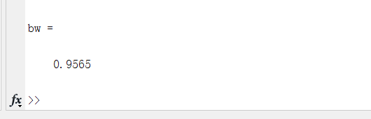
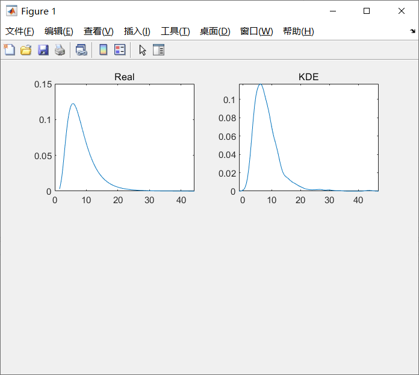
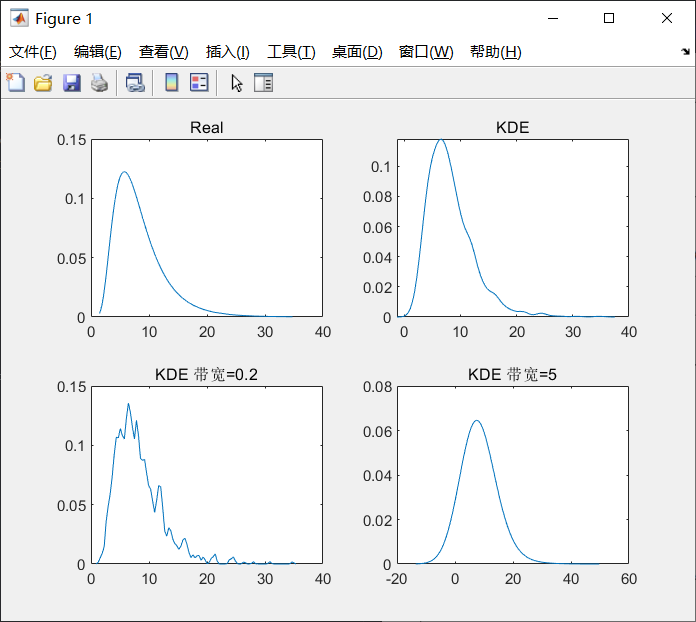
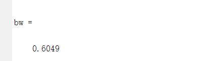
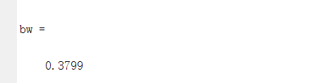
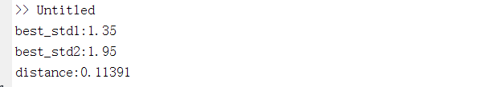
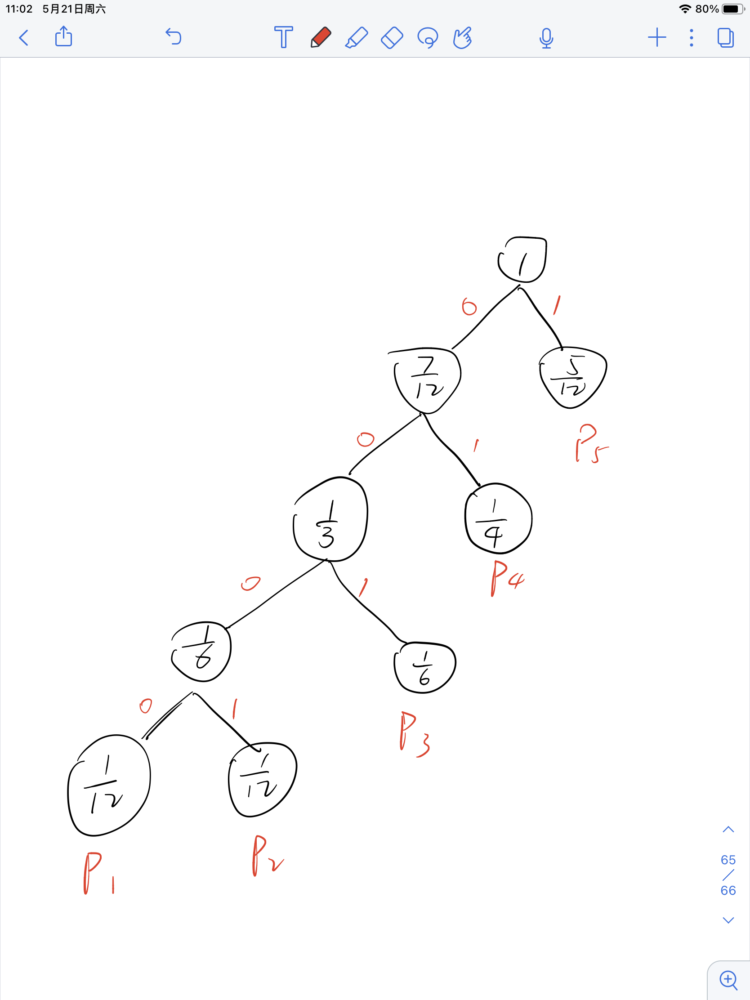

## 作业四
左之睿 191300087 人工智能学院 人工智能学院选修 本科
### 1、第八章习题2
(a)
$\int_{-\infty}^\infty p_1(x)dx=1\Rightarrow c_1=\alpha x_m^\alpha$，故$X$服从$Pareto(x_m,\alpha)$

(b)
似然函数$L(\alpha,x_m)=\prod\limits_{i=1}^np(x_i|\alpha,x_m)$，由概率密度函数可知，$x_i\geq x_m$

因此对数似然$LL(\alpha,x_m)=\sum\limits_{i=1}^n\ln\frac{\alpha x_m}{x_i^{\alpha+1}}=n\ln\alpha+\alpha n\ln x_m-(\alpha+1)\sum\limits_{i=1}^n\ln x_i$

$$\begin{cases}
    \frac{\partial LL}{\partial x_m}=\frac{\alpha n}{x_m}>0\\
    \frac{\partial LL}{\partial\alpha}=\frac{n}{\alpha}+n\ln x_m-\sum\limits_{i=1}^n\ln x_i=0
\end{cases}$$
注意到$LL$关于$x_m$单调增，所以最大化似然函数要求$x_m$取其最大值，其最大值为$\min\{x_i\}_{i=1}^n$，记$\{x_i\}_{i=1}^n$的最小值为$x_{min}$，
则$x_m=x_{min}$

此时，$\alpha=\frac{1}{\frac{1}{n}\sum\limits_{i=1}^n\ln x_i-\ln x_{min}}$

(c)
$\theta<x_m$时，$P(\theta|x_m,k)=0\Rightarrow p(\theta|\mathcal{D})=0$

$\theta\geq x_m$时，$$\begin{aligned}
    p(\theta|\mathcal{D})&=zp(\mathcal{D}|\theta)p(\theta|x_m,k)\\
    &=z*(\prod\limits_{i=1}^n\frac{1}{\theta})*\frac{kx_m^k}{\theta^{k+1}}\\
    &=\frac{zkx_m^k}{\theta^{n+k+1}}
\end{aligned}$$
$z$是系数，$\int_{-\infty}^\infty p(\theta|\mathcal{D})d\theta=1\Rightarrow z=\frac{(n+k)x_m^n}{k}$
因此，$\theta\geq x_m$时，$p(\theta|\mathcal{D})=\frac{(\theta+k)x^{\theta+k}_m}{\theta^{n+k+1}}$

综上所述，$p(\theta|\mathcal{D})=\frac{(\theta+k)x^{\theta+k}_m}{\theta^{n+k+1}}\mathbb{I}(\theta\geq x_m)\sim Pareto(x_m,n+k)$
### 2、第八章习题4
(a)代码如下：
```matlab
x=lognrnd(2,0.5,1000,1)
```
第一个参数为均值，第二个是标准差，第三个是行数，第四个是列数

(b)
如图，自动选择的带宽是0.9565(如果不控制随机种子的话是随机的，但都在0.85-1之间)



(c)
如图，带宽为0.2时生成的概率密度函数较陡峭且波动更大，带宽为5 时生成的概率密度函数
更光滑。**这个差异是由带宽导致的**


(d)图片分别是某次实验中10000，100000个样本输出的带宽


10000个样本时，选择的带宽在0.6上下
100000个样本时，带宽在0.38上下

趋势：随着样本数增大，带宽逐渐减小。
解释：因为数据点越多，越容易拟合真实密度函数，这时小的带宽可以增大数据在生成曲线时所占的比重，从而更好地拟合真实密度函数。

### 3、第八章习题5
(a)
第一行将iSigma定义为带宽的倒数
然后生成训练集，共有$101*101$个二维样本
再计算离散概率密度矩阵GT(初始化是全0)即关于所有样本的离散概率密度，最后进行离散化

(b)代码如下，其中p1，p2的标准差是随便取的：
```matlab
pts=-5:0.1:5;
p1=normpdf(pts,0,1);
p2=normpdf(pts,0,2);
approx=p1.'*p2;
approx=approx/(sum(approx(:)));
```

(c)这部分代码要接在题目给出的代码之后
```matlab
best_std1=0;
best_std2=0;
min_error=100000;
for std1=0.05:0.05:3
    for std2=0.05:0.05:3
        p1=normpdf(pts,0,std1);
        p2=normpdf(pts,0,std2);
        approx=p1.'*p2;
        approx=approx/sum(approx(:));
        error=1-sum(min(GT(:),approx(:)));
        if error<min_error
            min_error=error;
            best_std1=std1;
            best_std2=std2;
        end
    end
end
disp("best_std1:"+best_std1);
disp("best_std2:"+best_std2);
disp("distance:"+min_error);
```
结果如图

最佳值为1.35，1.95，距离为0.11391，距离较小，说明平均场近似有用
### 4、第十章习题1
(a)
$F_1=1,F_2=1,F_3=2,F_4=3,F_5=5,F_6=8$

(b)
移项，有$F_n-F_{n-1}-F_{n-2}=0$
特征方程$x^2-x-1=0\Rightarrow x_1=\alpha=\frac{1+\sqrt{5}}{2},x_2=\beta=\frac{1-\sqrt{5}}{2}$

故$F_n=c_1x_1^n+c_2x_2^n$，再利用$F_1=F_2=1$，可以解得$c_1=\frac{1}{\sqrt{5}},c_2=-\frac{1}{\sqrt{5}}$

故，$F_n=c_1x_1^n+c_2x_2^n=\frac{1}{\sqrt{5}}(\frac{1+\sqrt{5}}{2})^n-\frac{1}{\sqrt{5}}(\frac{1-\sqrt{5}}{2})^n=\frac{\alpha^n-\beta^n}{\sqrt{5}}=\frac{\alpha^n-\beta^n}{\alpha-\beta}$

(c)
$$\begin{aligned}
    \sum\limits_{i=3}^{n+2}F_i&=\sum\limits_{i=3}^{n+2}(F_{i-1}+F_{i-2})\\
    &=\sum\limits_{i=1}^n(F_{i+1}+F_{i})\\
    &=\sum\limits_{i=1}^nF_{i+1}+\sum\limits_{i=1}^nF_i\\
    &=\sum\limits_{i=3}^{n+1}F_{i}+F_2+\sum\limits_{i=1}^nF_i\\
    &=\sum\limits_{i=3}^{n+1}F_{i}+1+\sum\limits_{i=1}^nF_i
\end{aligned}$$
故$$\sum\limits_{i=3}^{n+2}F_i=\sum\limits_{i=3}^{n+1}F_{i}+1+\sum\limits_{i=1}^nF_i$$
即$$\sum\limits_{i=3}^{n+2}F_i-\sum\limits_{i=3}^{n+1}F_{i}-1=\sum\limits_{i=1}^nF_i$$
所以$$F_{n+2}-1=\sum\limits_{i=1}^nF_i$$
证毕

(d)
$\sum\limits_{i=k}^nF_i=F_{n+2}-1-\sum\limits_{i=1}^{k-1}F_i=F_{n+2}-F_{k+1}$
而$$\begin{aligned}
    \sum\limits_{i=1}^niF_i&=\sum\limits_{j=1}^n\sum\limits_{i=j}^nF_i\\
    &=\sum\limits_{j=1}^n(F_{n+2}-F_{j+1})\\
    &=nF_{n+2}-\sum\limits_{j=1}^nF_{j+1}
\end{aligned}$$
再利用(c)中的结论，有$\sum\limits_{j=1}^nF_{j+1}=\sum\limits_{j=1}^{n+1}F_j-1=F_{n+3}-2$

代入上式，得到$\sum\limits_{i=1}^niF_i=nF_{n+2}-F_{n+3}+2$，证毕

(e)这个分布是$\{1/12,1/12,1/6,1/4,5/12\}$
霍夫曼树如图


更一般的情况下：
霍夫曼树是一个高度为n的二叉树，并且只有底层有两个叶节点，其他每层都只有一个叶节点(实际上就是自底向上一层一层生成)，叶节点就对应每个概率，且高度越高，概率越大。

(f)
各个概率编码长度依次为(按概率从小到大顺序)$n-1,n-1,n-2,...,1$（因为最底层两个叶节点）
$n=1$时分布是固定的，需要的比特数为0

$n>1$时：平均比特数为$B_n=(n-1)\frac{F_1}{F_{n+2}-1}+\sum\limits_{i=2}^n(n-i+1)\frac{F_i}{F_{n+2}-1}$

对上式进行化简，$$\begin{aligned}
    B_n&=\frac{(n-1)F_1+\sum\limits_{i=2}^n(n-i+1)F_i}{F_{n+2}-1}\\
    &=\frac{-1+\sum\limits_{i=1}^n(n-i+1)F_i}{F_{n+2}-1}\\
    &=\frac{-1+\sum\limits_{j=1}^n\sum\limits_{i=1}^jF_i}{F_{n+2}-1}\\
    &=\frac{-1+\sum\limits_{j=1}^n(F_{j+2}-1)}{F_{n+2}-1}\\
    &=\frac{\sum\limits_{j=3}^{n+2}F_j-n-1}{F_{n+2}-1}\\
    &=\frac{\sum\limits_{j=1}^{n+2}F_j-n-3}{F_{n+2}-1}\\
    &=\frac{F_{n+4}-(n+4)}{F_{n+2}-1}
\end{aligned}$$
证毕

(g)
$B_n=\frac{F_{n+4}-n-4}{F_{n+2}-1}=\frac{F_{n+3}+F_{n+2}-n-4}{F_{n+2}-1}=1+\frac{F_{n+3}}{F_{n+2}-1}-\frac{n+3}{F_{n+2}-1}$

$\frac{F_{n+1}}{F_n}=1+\frac{F_{n-1}}{F_n}$，令$k=\lim\limits_{n\rightarrow\infty}\frac{F_{n+1}}{F_n}$，对两边取极限有$k=1+1/k$，显然$k>0$，可以解得$k=\frac{1+\sqrt{5}}{2}$

所以$\lim\limits_{n\rightarrow\infty}B_n=1+\lim\limits_{n\rightarrow\infty}(\frac{F_{n+3}}{F_{n+2}-1}-\frac{n+3}{F_{n+2}-1})=1+k=\frac{3+\sqrt{5}}{2}$
即，n很大时，需要$\frac{3+\sqrt{5}}{2}$向上取整 个比特来编码

### 5、第十章习题6
$X$的熵$h(X)=-\int q(x)\ln q(x)dx$

当$X$是参数为$1/\lambda$的指数分布$p(x)$时：
$h(X)=-\int_0^\infty p(x)\ln p(x)dx=1-\ln\lambda$

而$$\begin{aligned}
    -\int q(x)\ln p(x)dx&=-\int q(x)\ln\lambda e^{-\lambda x}dx\\
    &=-\int q(x)(\ln\lambda-\lambda x)dx\\
    &=-\ln\lambda\int q(x)dx+\lambda\int xq(x)dx\\
    &=-\ln\lambda+\lambda\mu=1-\ln\lambda\\
    &=-\int p(x)\ln p(x)dx
\end{aligned}$$

设任意分布$q(x)$下的熵为$h_1(X)$
$$\begin{aligned}
    h(X)-h_1(X)&=-\int p(x)\ln p(x)dx+\int q(x)\ln q(x)dx\\
    &=\int [-q(x)\ln p(x)+q(x)\ln q(x)]dx\\
    &=\int q(x)\ln\frac{q(x)}{p(x)}dx\\
\end{aligned}$$
由$\ln \frac{1}{x}\geq 1-x$
上式$\geq\int q(x)(1-\frac{p(x)}{q(x)})dx=\int q(x)dx-\int p(x)dx=0$

即，对任意分布都有$h(X)-h_1(X)\geq0$，因此指数分布是该约束下的最大熵分布
### 6、第十二章习题3
(a)
$P(A,B|C)=\frac{P(A,B,C)}{P(C)}=\frac{P(B|C)R(C|A)P(A)}{P(C)}=P(B|C)\frac{P(A,C)}{P(C)}=P(B|C)P(A|C)$
故$A\bot B|C$

(b)
$P(A,B|C)=\frac{P(A,B,C)}{P(C)}=\frac{P(A|C)P(C|B)P(B)}{P(C)}=P(A|C)\frac{P(B,C)}{P(C)}=P(A|C)P(B|C)$
故$A\bot B|C$

(c)
$P(A,B|C)=\frac{P(A,B,C)}{P(C)}=\frac{P(A|C)P(B|C)P(C)}{P(C)}=P(A|C)P(B|C)$
故$A\bot B|C$

(d)
$C$没被观察到的时候，
$P(A,B,C)=\sum\limits_CP(A,B,C)=\sum\limits_CP(C|A,B)P(A)P(B)$
$\ \ \ \ \ \ \ \ \ \ \ \ \ \ \ \ \ \ \ \ \ =P(A)P(B)\sum\limits_CP(C|A,B)=P(A)P(B)$

举例：A是努力程度，B是课程难度，C是最终成绩，当不知道成绩(C)时，A和B显然独立。
但是知道成绩(C)之后，A和B之间就会存在联系，如成绩很高时，若A是不努力，则B很有可能代表课程不难

(e)
当观测到C的后代F后，他会给我们提供部分关于C的信息，导致A和B之间存在依赖关系。

比如在(d)中的举例，我们观测到学生受到表扬，那么他将会给我们提供：成绩较好这一信息，同样会导致A和B之间存在联系