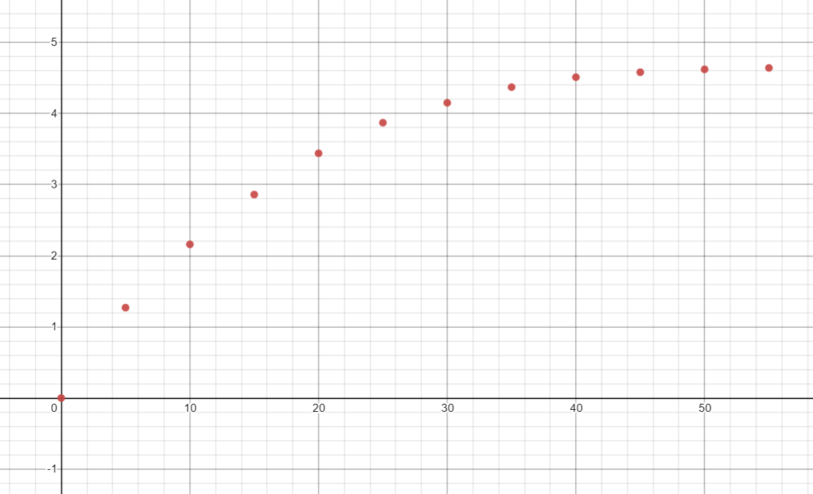

## 第3章作业
### P78：第6题
$a_1=\frac{f(0)-f(0.5\pi)}{0-0.5\pi}=\frac{2}{\pi}\approx0.636620$
$f'(x_2)=\cos x_2=a_1\Rightarrow x_2=\arg\cos\frac{2}{\pi}\approx0.880689$
$a_0=\frac{f(0)+f(x_2)}{2}-\frac{x_2+0}{2}\cdot\frac{f(0)-f(0.5\pi)}{0-0.5\pi}\approx0.105257$

故要求的最佳一次逼近多项式为：$$P_1(x)=0.105257+0.636620x$$

其误差$\max\limits_{0\leq x\leq0.5\pi}|\sin x-P_1(x)|=0.105257$

### P78：第17题
$f(x)=x^2,x\in[0,1]$，设权函数$\rho(x)\equiv1$
先看$\varphi_1$
其法方程为$$
\begin{cases}
a_0(1,1)+a_1(1,x)=(x^2,1)\\
a_0(x,1)+a_1(x,x)=(x^2,x)
\end{cases}
$$
解得$a_0=-\frac{1}{6},a_1=1$
故最佳平方逼近$S^*(x)=a_0\cdot1+a_1\cdot x=-\frac{1}{6}+x$

再看$\varphi_2$
其法方程为$$
\begin{cases}
a_0(x^{100},x^{100})+a_1(x^{100},x^{101})=(x^2,x^{100})\\
a_0(x^{101},x^{100})+a_1(x^{101},x^{101})=(x^2,x^{101})
\end{cases}
$$
解得$a_0=375.242532,a_1=-375.148245$
故最佳平方逼近$S^*(x)=a_0\cdot x^{100}+a_1\cdot x^{101}=375.242532x^{100}-375.148245x^{101}$

$\phi_1$上得到的最佳平方逼近更好

### P78：第20题（Chebyshev多项式展开不做）
$f(x)=\sin\frac{1}{2}x$，设权函数$\rho(x)\equiv1$
$$\begin{aligned}
&(f,P_0)=\int_{-1}^1\sin\frac{1}{2}xdx=0\\
&(f,P_1)=\int_{-1}^1x\sin\frac{1}{2}xdx=0.325074\\
&(f,P_2)=\int_{-1}^1(\frac{3}{2}x^2-\frac{1}{2})\sin\frac{1}{2}xdx=0\\
&(f,P_3)=\int_{-1}^1(\frac{5}{2}x^3-\frac{3}{2}x)\sin\frac{1}{2}xdx=-0.002348
\end{aligned}$$
由于$a_k^*=\frac{(f,P_k)}{(P_k,P_k)}$
$$\Rightarrow\begin{cases}a_0^*=0\\
a_1^*=0.487611\\
a_2^*=0\\
a_3^*=-0.008218
\end{cases}$$
代入得到$$\begin{aligned}S_3^*(x)&=0.487611x-0.008218(2.5x^3-1.5x)\\
&=0.499938x-0.020545x^3
\end{aligned}$$
误差图形如图

均方误差$||\delta||^2=\sqrt{||f||_2^2-\sum\limits_{k=0}^3a^k(f,P_k)}\approx0.000247$

### P78：第22题
$\Phi=\{1, x^2\}$，设权函数$w(x)\equiv1$，故
$$\begin{cases}
(1,1)=5\\
(1,x^2)=19^2+25^2+31^2+38^2+44^2=5327\\
(x^2,1)=5327\\
(x^2,x^2)==19^4+25^4+31^4+38^4+44^4=7277699
\end{cases}$$
$$\begin{cases}
(f,1)=\sum_iy_i=271.4\\
(f,x^2)=\sum_iy_ix_i^2=369321.5\\
\end{cases}$$
故求解如下方程组即可：
$$\begin{cases}
5a+5327b=271.4\\
5327a+7277699b=369321.5
\end{cases}
$$
最终解得$a=0.972605,b=0.050035$
经验公式为$y=S(x)=0.972605+0.050035x^2$
均方误差$$\delta=\sum_i(y_i-S(x_i))^2\approx0.1226$$

### P79：第24题
先描点画图，图片如下

观察图形，选取$y=ae^{-\frac{b}{t}}$进行拟合
$y=ae^{-\frac{b}{t}}\Rightarrow lny=lna-b\cdot\frac{1}{t}$
令$\bar{y}=lny,A=lna,x=\frac{1}{t}$，此时为利用$(x_i,\bar{y}_i)$拟合$\bar{y}=A-bx$
$\Phi=\{1,x\}$，取权函数$w(x)\equiv1$，不考虑点$(0,0)$
$(1,1)=11,(1,x)=(x,1)=\sum_i\frac{1}{t_i}=0.603975$
$(x,x)=\sum_i\frac{1}{t^2_i}=0.062321$
$(f,1)=\sum_ilny_i=13.639649$
$(f,x)=\sum_i\frac{1}{t_i}lny_i=0.530330$
故求解如下方程组即可：
$$\begin{cases}
11A-0.603975b=13.639649\\
0.603975A-0.062321b=0.530330
\end{cases}$$
解得$A=1.651562,b=7.496221$
故$lny=1.651562-7.496221\frac{1}{t}$
$$y=5.215119e^{-\frac{7.496221}{t}}(*10^{-4})$$

### P104：第1题(3)
先令$f(x)=1$，有$\int_{-1}^1f(x)dx=[f(-1)+2f(x_1)+3f(x_2)]/3$
再分别令$f(x)=x.f(x)=x^2$，有：
$$\begin{cases}
    0=-1+x_1+3x_2\\
    2=1+2x_1^2+3x^2_2
\end{cases}$$
解得$$\begin{cases}
    x_1=-0.289898\\
    x_2=0.626599
\end{cases}
或\begin{cases}
    x_1=0.689898\\
    x_2=-0.126599
\end{cases}$$
对于任意一组参数，都有：$\int_{-1}^1x^3dx\not=(-1+2x_1^3+3x_2^3)/3$，故该公式具有2次代数精度
参数即为上述两组$x_1,x_2$

### P104：第2题(1)
步长$h=1/8$
梯形公式：$T_8=\sum\limits_{k=0}^7h\cdot\frac{f(kh)+f(kh+h)}{2}=0.1114024$

Simpson公式：$S_8=\sum\limits_{k=0}^7\frac{h}{6}\cdot[f(kh)+4f(kh+0.5h)+f(kh+h)]=0.1115718$
### P105：第7题(题目改成课程PPT上内容)
复化梯形法的余项$|R_T|=|-\frac{b-a}{12}h^2f''(\eta)|=|-\frac{1}{12}\frac{1}{n^2}f''(\eta)|\leq\frac{1}{12n^2}e\leq0.5*10^{-5}$
由$\frac{1}{12n^2}e\leq0.5*10^{-5}\Rightarrow n\geq212.849$
故复化梯形法要求$n=213$及以上，即至少把区间分成213等分

复化Simpson法的余项$|S_T|=|-\frac{b-a}{180*2^4}h^4f^{(4)}(\eta)|=|-\frac{1}{180*2^4}\frac{1}{n^4}f^{(4)}(\eta)|\leq\frac{1}{180*2^4n^4}e\leq0.5*10^{-5}$
由$\frac{1}{180*2^4n^4}e\leq0.5*10^{-5}\Rightarrow n\geq3.707$
故复化Simpson法要求$n=4$及以上，及至少把区间分成4等分(但实际上还需要每个小区间中点的函数值，理解为8等分也可以)
### P105：第11题
(1)列出T数表
$T_0^{(0)}=1.3333333$
$T_0^{(1)}=1.1666667,T_1^{(0)}=1.1111111$
$T_0^{(2)}=1.1166667,T_1^{(1)}=1.10000000,T_2^{(0)}=1.0992593$
$T_0^{(3)}=1.1032107,T_1^{(2)}=1.0987253,T_2^{(1)}=1.0986403,T_3^{(0)}=1.0986305$
$T_0^{(4)}=1.0997677,T_1^{(3)}=1.0986200,T_2^{(2)}=1.0986130,T_3^{(1)}=1.0986126,T_4^{(0)}=1.0986125$

最终，$I=1.0986125$

(2)首先把积分区间变化到$[-1,1]$，令$y=x+2$，$x\in[-1,1]$
此时$\int_1^3\frac{1}{y}dy=\int_{-1}^1\frac{1}{x+2}dx$

先用三点高斯：$P_3(x)=(5x^3-3x)/2$
其零点为$0,\frac{\sqrt{15}}{5},-\frac{\sqrt{15}}{5}$
故$\int_{-1}^1\frac{1}{x+2}dx\approx A_0f(0)+A_1f(\frac{\sqrt{15}}{5})+A_2f(-\frac{\sqrt{15}}{5})$
令其对$f(x)=1,x,x^2$准确成立，求得$A_0,A_1,A_2$最终带入得到
$$\int_1^3\frac{1}{y}dy=\int_{-1}^1\frac{1}{x+2}dx\approx1.0980393$$
&nbsp;

再用五点高斯：$P_5(x)=(63x^5-70x^3+15x)/8$
其零点为$0,0.9061798,-0.9061798,0.5384693,-0.5384693$
故$\int_{-1}^1\frac{1}{x+2}dx\approx A_0f(x_0)+A_1f(x_1)+A_2f(x_2)+A_3f(x_4)+A_4f(x_4)$
令其分别对$f(x)=1,x,x^2,x^3,x^4$准确成立，求得$A_0,A_1,A_2,A_3,A_4$，最终带入得到$$\int_1^3\frac{1}{y}dy=\int_{-1}^1\frac{1}{x+2}dx\approx1.0986093$$
&nbsp;
(3)把$[1,3]$四等分然后各个区间用Gauss公式再求和，仅给出求第一个小区间的具体过程，另外三个方法一样
$I_1=\int_1^{1.5}\frac{1}{y}dy=\int_{-1}^1\frac{0.5}{2.5+0.5t}dt$
$P_2(x)=0\Rightarrow x=1/\sqrt{3},-1/\sqrt{3}$
故$\int_{-1}^1\frac{0.5}{2.5+0.5t}dt\approx A_1f(1/\sqrt{3})+A_2f(-1/\sqrt{3})$
令上式对$f(t)=1,t$准确成立，解得$A_1=A_2=1$
故$$I_1\approx\frac{0.5}{2.5+0.5/\sqrt{3}}+\frac{0.5}{2.5-0.5/\sqrt{3}}\approx0.4054054$$
类似的，有$I_2\approx0.2876712,I_3\approx0.2231405,I_4\approx0.1823204$

故$I=I_1+I_2+I_3+I_4\approx1.0985375$
